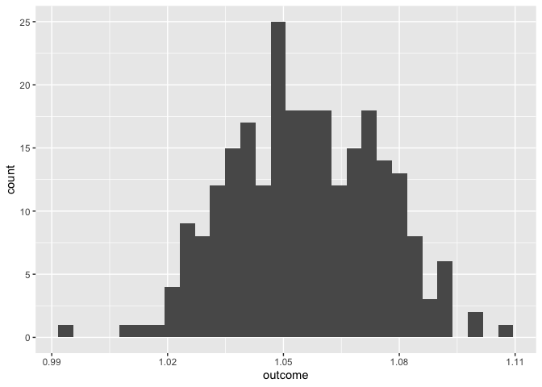

Final project
================

``` r
library(tidyverse)
```

    ## ── Attaching packages ─────────────────────────────────────── tidyverse 1.3.2 ──
    ## ✔ ggplot2 3.4.0      ✔ purrr   0.3.5 
    ## ✔ tibble  3.1.8      ✔ dplyr   1.0.10
    ## ✔ tidyr   1.2.0      ✔ stringr 1.4.1 
    ## ✔ readr   2.1.2      ✔ forcats 0.5.2 
    ## ── Conflicts ────────────────────────────────────────── tidyverse_conflicts() ──
    ## ✖ dplyr::filter() masks stats::filter()
    ## ✖ dplyr::lag()    masks stats::lag()

``` r
library(GGally)
```

    ## Registered S3 method overwritten by 'GGally':
    ##   method from   
    ##   +.gg   ggplot2

``` r
library(patchwork)
library(gt)
library(leaps)
library(caret)
```

    ## Loading required package: lattice
    ## 
    ## Attaching package: 'caret'
    ## 
    ## The following object is masked from 'package:purrr':
    ## 
    ##     lift

``` r
library(readxl)
library(patchwork)
```

``` r
body_density_df = read_excel("data/body_density_data.xlsx") %>%
  rename(outcome = bodyfat_brozek) %>% 
  select(-bodyfat_siri & -body_density)
head(body_density_df)
```

    ## # A tibble: 6 × 15
    ##      id outcome   age weight height  neck chest abdomen   hip thigh  knee ankle
    ##   <dbl>   <dbl> <dbl>  <dbl>  <dbl> <dbl> <dbl>   <dbl> <dbl> <dbl> <dbl> <dbl>
    ## 1     1    12.6    23   154.   67.8  36.2  93.1    85.2  94.5  59    37.3  21.9
    ## 2     2     6.9    22   173.   72.2  38.5  93.6    83    98.7  58.7  37.3  23.4
    ## 3     3    24.6    22   154    66.2  34    95.8    87.9  99.2  59.6  38.9  24  
    ## 4     4    10.9    26   185.   72.2  37.4 102.     86.4 101.   60.1  37.3  22.8
    ## 5     5    27.8    24   184.   71.2  34.4  97.3   100   102.   63.2  42.2  24  
    ## 6     6    20.6    24   210.   74.8  39   104.     94.4 108.   66    42    25.6
    ## # … with 3 more variables: bicep <dbl>, forearm <dbl>, wrist <dbl>

Descriptive statistics:

``` r
body_density_df %>%
  gtsummary::tbl_summary() %>%
  gtsummary::bold_labels()
```

<div id="orgytlhusc" style="overflow-x:auto;overflow-y:auto;width:auto;height:auto;">
<style>html {
  font-family: -apple-system, BlinkMacSystemFont, 'Segoe UI', Roboto, Oxygen, Ubuntu, Cantarell, 'Helvetica Neue', 'Fira Sans', 'Droid Sans', Arial, sans-serif;
}

#orgytlhusc .gt_table {
  display: table;
  border-collapse: collapse;
  margin-left: auto;
  margin-right: auto;
  color: #333333;
  font-size: 16px;
  font-weight: normal;
  font-style: normal;
  background-color: #FFFFFF;
  width: auto;
  border-top-style: solid;
  border-top-width: 2px;
  border-top-color: #A8A8A8;
  border-right-style: none;
  border-right-width: 2px;
  border-right-color: #D3D3D3;
  border-bottom-style: solid;
  border-bottom-width: 2px;
  border-bottom-color: #A8A8A8;
  border-left-style: none;
  border-left-width: 2px;
  border-left-color: #D3D3D3;
}

#orgytlhusc .gt_heading {
  background-color: #FFFFFF;
  text-align: center;
  border-bottom-color: #FFFFFF;
  border-left-style: none;
  border-left-width: 1px;
  border-left-color: #D3D3D3;
  border-right-style: none;
  border-right-width: 1px;
  border-right-color: #D3D3D3;
}

#orgytlhusc .gt_title {
  color: #333333;
  font-size: 125%;
  font-weight: initial;
  padding-top: 4px;
  padding-bottom: 4px;
  padding-left: 5px;
  padding-right: 5px;
  border-bottom-color: #FFFFFF;
  border-bottom-width: 0;
}

#orgytlhusc .gt_subtitle {
  color: #333333;
  font-size: 85%;
  font-weight: initial;
  padding-top: 0;
  padding-bottom: 6px;
  padding-left: 5px;
  padding-right: 5px;
  border-top-color: #FFFFFF;
  border-top-width: 0;
}

#orgytlhusc .gt_bottom_border {
  border-bottom-style: solid;
  border-bottom-width: 2px;
  border-bottom-color: #D3D3D3;
}

#orgytlhusc .gt_col_headings {
  border-top-style: solid;
  border-top-width: 2px;
  border-top-color: #D3D3D3;
  border-bottom-style: solid;
  border-bottom-width: 2px;
  border-bottom-color: #D3D3D3;
  border-left-style: none;
  border-left-width: 1px;
  border-left-color: #D3D3D3;
  border-right-style: none;
  border-right-width: 1px;
  border-right-color: #D3D3D3;
}

#orgytlhusc .gt_col_heading {
  color: #333333;
  background-color: #FFFFFF;
  font-size: 100%;
  font-weight: normal;
  text-transform: inherit;
  border-left-style: none;
  border-left-width: 1px;
  border-left-color: #D3D3D3;
  border-right-style: none;
  border-right-width: 1px;
  border-right-color: #D3D3D3;
  vertical-align: bottom;
  padding-top: 5px;
  padding-bottom: 6px;
  padding-left: 5px;
  padding-right: 5px;
  overflow-x: hidden;
}

#orgytlhusc .gt_column_spanner_outer {
  color: #333333;
  background-color: #FFFFFF;
  font-size: 100%;
  font-weight: normal;
  text-transform: inherit;
  padding-top: 0;
  padding-bottom: 0;
  padding-left: 4px;
  padding-right: 4px;
}

#orgytlhusc .gt_column_spanner_outer:first-child {
  padding-left: 0;
}

#orgytlhusc .gt_column_spanner_outer:last-child {
  padding-right: 0;
}

#orgytlhusc .gt_column_spanner {
  border-bottom-style: solid;
  border-bottom-width: 2px;
  border-bottom-color: #D3D3D3;
  vertical-align: bottom;
  padding-top: 5px;
  padding-bottom: 5px;
  overflow-x: hidden;
  display: inline-block;
  width: 100%;
}

#orgytlhusc .gt_group_heading {
  padding-top: 8px;
  padding-bottom: 8px;
  padding-left: 5px;
  padding-right: 5px;
  color: #333333;
  background-color: #FFFFFF;
  font-size: 100%;
  font-weight: initial;
  text-transform: inherit;
  border-top-style: solid;
  border-top-width: 2px;
  border-top-color: #D3D3D3;
  border-bottom-style: solid;
  border-bottom-width: 2px;
  border-bottom-color: #D3D3D3;
  border-left-style: none;
  border-left-width: 1px;
  border-left-color: #D3D3D3;
  border-right-style: none;
  border-right-width: 1px;
  border-right-color: #D3D3D3;
  vertical-align: middle;
}

#orgytlhusc .gt_empty_group_heading {
  padding: 0.5px;
  color: #333333;
  background-color: #FFFFFF;
  font-size: 100%;
  font-weight: initial;
  border-top-style: solid;
  border-top-width: 2px;
  border-top-color: #D3D3D3;
  border-bottom-style: solid;
  border-bottom-width: 2px;
  border-bottom-color: #D3D3D3;
  vertical-align: middle;
}

#orgytlhusc .gt_from_md > :first-child {
  margin-top: 0;
}

#orgytlhusc .gt_from_md > :last-child {
  margin-bottom: 0;
}

#orgytlhusc .gt_row {
  padding-top: 8px;
  padding-bottom: 8px;
  padding-left: 5px;
  padding-right: 5px;
  margin: 10px;
  border-top-style: solid;
  border-top-width: 1px;
  border-top-color: #D3D3D3;
  border-left-style: none;
  border-left-width: 1px;
  border-left-color: #D3D3D3;
  border-right-style: none;
  border-right-width: 1px;
  border-right-color: #D3D3D3;
  vertical-align: middle;
  overflow-x: hidden;
}

#orgytlhusc .gt_stub {
  color: #333333;
  background-color: #FFFFFF;
  font-size: 100%;
  font-weight: initial;
  text-transform: inherit;
  border-right-style: solid;
  border-right-width: 2px;
  border-right-color: #D3D3D3;
  padding-left: 5px;
  padding-right: 5px;
}

#orgytlhusc .gt_stub_row_group {
  color: #333333;
  background-color: #FFFFFF;
  font-size: 100%;
  font-weight: initial;
  text-transform: inherit;
  border-right-style: solid;
  border-right-width: 2px;
  border-right-color: #D3D3D3;
  padding-left: 5px;
  padding-right: 5px;
  vertical-align: top;
}

#orgytlhusc .gt_row_group_first td {
  border-top-width: 2px;
}

#orgytlhusc .gt_summary_row {
  color: #333333;
  background-color: #FFFFFF;
  text-transform: inherit;
  padding-top: 8px;
  padding-bottom: 8px;
  padding-left: 5px;
  padding-right: 5px;
}

#orgytlhusc .gt_first_summary_row {
  border-top-style: solid;
  border-top-color: #D3D3D3;
}

#orgytlhusc .gt_first_summary_row.thick {
  border-top-width: 2px;
}

#orgytlhusc .gt_last_summary_row {
  padding-top: 8px;
  padding-bottom: 8px;
  padding-left: 5px;
  padding-right: 5px;
  border-bottom-style: solid;
  border-bottom-width: 2px;
  border-bottom-color: #D3D3D3;
}

#orgytlhusc .gt_grand_summary_row {
  color: #333333;
  background-color: #FFFFFF;
  text-transform: inherit;
  padding-top: 8px;
  padding-bottom: 8px;
  padding-left: 5px;
  padding-right: 5px;
}

#orgytlhusc .gt_first_grand_summary_row {
  padding-top: 8px;
  padding-bottom: 8px;
  padding-left: 5px;
  padding-right: 5px;
  border-top-style: double;
  border-top-width: 6px;
  border-top-color: #D3D3D3;
}

#orgytlhusc .gt_striped {
  background-color: rgba(128, 128, 128, 0.05);
}

#orgytlhusc .gt_table_body {
  border-top-style: solid;
  border-top-width: 2px;
  border-top-color: #D3D3D3;
  border-bottom-style: solid;
  border-bottom-width: 2px;
  border-bottom-color: #D3D3D3;
}

#orgytlhusc .gt_footnotes {
  color: #333333;
  background-color: #FFFFFF;
  border-bottom-style: none;
  border-bottom-width: 2px;
  border-bottom-color: #D3D3D3;
  border-left-style: none;
  border-left-width: 2px;
  border-left-color: #D3D3D3;
  border-right-style: none;
  border-right-width: 2px;
  border-right-color: #D3D3D3;
}

#orgytlhusc .gt_footnote {
  margin: 0px;
  font-size: 90%;
  padding-left: 4px;
  padding-right: 4px;
  padding-left: 5px;
  padding-right: 5px;
}

#orgytlhusc .gt_sourcenotes {
  color: #333333;
  background-color: #FFFFFF;
  border-bottom-style: none;
  border-bottom-width: 2px;
  border-bottom-color: #D3D3D3;
  border-left-style: none;
  border-left-width: 2px;
  border-left-color: #D3D3D3;
  border-right-style: none;
  border-right-width: 2px;
  border-right-color: #D3D3D3;
}

#orgytlhusc .gt_sourcenote {
  font-size: 90%;
  padding-top: 4px;
  padding-bottom: 4px;
  padding-left: 5px;
  padding-right: 5px;
}

#orgytlhusc .gt_left {
  text-align: left;
}

#orgytlhusc .gt_center {
  text-align: center;
}

#orgytlhusc .gt_right {
  text-align: right;
  font-variant-numeric: tabular-nums;
}

#orgytlhusc .gt_font_normal {
  font-weight: normal;
}

#orgytlhusc .gt_font_bold {
  font-weight: bold;
}

#orgytlhusc .gt_font_italic {
  font-style: italic;
}

#orgytlhusc .gt_super {
  font-size: 65%;
}

#orgytlhusc .gt_footnote_marks {
  font-style: italic;
  font-weight: normal;
  font-size: 75%;
  vertical-align: 0.4em;
}

#orgytlhusc .gt_asterisk {
  font-size: 100%;
  vertical-align: 0;
}

#orgytlhusc .gt_indent_1 {
  text-indent: 5px;
}

#orgytlhusc .gt_indent_2 {
  text-indent: 10px;
}

#orgytlhusc .gt_indent_3 {
  text-indent: 15px;
}

#orgytlhusc .gt_indent_4 {
  text-indent: 20px;
}

#orgytlhusc .gt_indent_5 {
  text-indent: 25px;
}
</style>
<table class="gt_table">
  
  <thead class="gt_col_headings">
    <tr>
      <th class="gt_col_heading gt_columns_bottom_border gt_left" rowspan="1" colspan="1" scope="col"><strong>Characteristic</strong></th>
      <th class="gt_col_heading gt_columns_bottom_border gt_center" rowspan="1" colspan="1" scope="col"><strong>N = 252</strong><sup class="gt_footnote_marks">1</sup></th>
    </tr>
  </thead>
  <tbody class="gt_table_body">
    <tr><td class="gt_row gt_left" style="font-weight: bold;">id</td>
<td class="gt_row gt_center">126 (64, 189)</td></tr>
    <tr><td class="gt_row gt_left" style="font-weight: bold;">outcome</td>
<td class="gt_row gt_center">19 (13, 25)</td></tr>
    <tr><td class="gt_row gt_left" style="font-weight: bold;">age</td>
<td class="gt_row gt_center">43 (36, 54)</td></tr>
    <tr><td class="gt_row gt_left" style="font-weight: bold;">weight</td>
<td class="gt_row gt_center">176 (159, 197)</td></tr>
    <tr><td class="gt_row gt_left" style="font-weight: bold;">height</td>
<td class="gt_row gt_center">70.00 (68.25, 72.25)</td></tr>
    <tr><td class="gt_row gt_left" style="font-weight: bold;">neck</td>
<td class="gt_row gt_center">38.00 (36.40, 39.42)</td></tr>
    <tr><td class="gt_row gt_left" style="font-weight: bold;">chest</td>
<td class="gt_row gt_center">100 (94, 105)</td></tr>
    <tr><td class="gt_row gt_left" style="font-weight: bold;">abdomen</td>
<td class="gt_row gt_center">91 (85, 99)</td></tr>
    <tr><td class="gt_row gt_left" style="font-weight: bold;">hip</td>
<td class="gt_row gt_center">99 (96, 104)</td></tr>
    <tr><td class="gt_row gt_left" style="font-weight: bold;">thigh</td>
<td class="gt_row gt_center">59.0 (56.0, 62.3)</td></tr>
    <tr><td class="gt_row gt_left" style="font-weight: bold;">knee</td>
<td class="gt_row gt_center">38.50 (36.98, 39.92)</td></tr>
    <tr><td class="gt_row gt_left" style="font-weight: bold;">ankle</td>
<td class="gt_row gt_center">22.80 (22.00, 24.00)</td></tr>
    <tr><td class="gt_row gt_left" style="font-weight: bold;">bicep</td>
<td class="gt_row gt_center">32.05 (30.20, 34.32)</td></tr>
    <tr><td class="gt_row gt_left" style="font-weight: bold;">forearm</td>
<td class="gt_row gt_center">28.70 (27.30, 30.00)</td></tr>
    <tr><td class="gt_row gt_left" style="font-weight: bold;">wrist</td>
<td class="gt_row gt_center">18.30 (17.60, 18.80)</td></tr>
  </tbody>
  
  <tfoot class="gt_footnotes">
    <tr>
      <td class="gt_footnote" colspan="2"><sup class="gt_footnote_marks">1</sup> Median (IQR)</td>
    </tr>
  </tfoot>
</table>
</div>

``` r
summary(body_density_df)
```

    ##        id            outcome           age            weight     
    ##  Min.   :  1.00   Min.   : 0.00   Min.   :22.00   Min.   :118.5  
    ##  1st Qu.: 63.75   1st Qu.:12.80   1st Qu.:35.75   1st Qu.:159.0  
    ##  Median :126.50   Median :19.00   Median :43.00   Median :176.5  
    ##  Mean   :126.50   Mean   :18.94   Mean   :44.88   Mean   :178.9  
    ##  3rd Qu.:189.25   3rd Qu.:24.60   3rd Qu.:54.00   3rd Qu.:197.0  
    ##  Max.   :252.00   Max.   :45.10   Max.   :81.00   Max.   :363.1  
    ##      height           neck           chest           abdomen      
    ##  Min.   :64.00   Min.   :31.10   Min.   : 79.30   Min.   : 69.40  
    ##  1st Qu.:68.25   1st Qu.:36.40   1st Qu.: 94.35   1st Qu.: 84.58  
    ##  Median :70.00   Median :38.00   Median : 99.65   Median : 90.95  
    ##  Mean   :70.31   Mean   :37.99   Mean   :100.82   Mean   : 92.56  
    ##  3rd Qu.:72.25   3rd Qu.:39.42   3rd Qu.:105.38   3rd Qu.: 99.33  
    ##  Max.   :77.75   Max.   :51.20   Max.   :136.20   Max.   :148.10  
    ##       hip            thigh            knee           ankle          bicep      
    ##  Min.   : 85.0   Min.   :47.20   Min.   :33.00   Min.   :19.1   Min.   :24.80  
    ##  1st Qu.: 95.5   1st Qu.:56.00   1st Qu.:36.98   1st Qu.:22.0   1st Qu.:30.20  
    ##  Median : 99.3   Median :59.00   Median :38.50   Median :22.8   Median :32.05  
    ##  Mean   : 99.9   Mean   :59.41   Mean   :38.59   Mean   :23.1   Mean   :32.27  
    ##  3rd Qu.:103.5   3rd Qu.:62.35   3rd Qu.:39.92   3rd Qu.:24.0   3rd Qu.:34.33  
    ##  Max.   :147.7   Max.   :87.30   Max.   :49.10   Max.   :33.9   Max.   :45.00  
    ##     forearm          wrist      
    ##  Min.   :21.00   Min.   :15.80  
    ##  1st Qu.:27.30   1st Qu.:17.60  
    ##  Median :28.70   Median :18.30  
    ##  Mean   :28.66   Mean   :18.23  
    ##  3rd Qu.:30.00   3rd Qu.:18.80  
    ##  Max.   :34.90   Max.   :21.40

Exploratory plots

``` r
body_density_df %>%
  relocate(outcome) %>%
  ggpairs()
```

<!-- -->

Histogram plots

``` r
hist1 = body_density_df %>% 
  ggplot(aes(x = age)) +
  geom_histogram()
hist2 = body_density_df %>% 
  ggplot(aes(x = weight)) +
  geom_histogram()
hist3 = body_density_df %>% 
  ggplot(aes(x = height)) +
  geom_histogram()

hist1 + hist2 + hist3
```

    ## `stat_bin()` using `bins = 30`. Pick better value with `binwidth`.
    ## `stat_bin()` using `bins = 30`. Pick better value with `binwidth`.
    ## `stat_bin()` using `bins = 30`. Pick better value with `binwidth`.

<!-- -->

``` r
hist4 = body_density_df %>% 
  ggplot(aes(x = neck)) +
  geom_histogram()
hist5 = body_density_df %>% 
  ggplot(aes(x = chest)) +
  geom_histogram()
hist6 = body_density_df %>% 
  ggplot(aes(x = abdomen)) +
  geom_histogram()

hist4 + hist5 + hist6
```

    ## `stat_bin()` using `bins = 30`. Pick better value with `binwidth`.
    ## `stat_bin()` using `bins = 30`. Pick better value with `binwidth`.
    ## `stat_bin()` using `bins = 30`. Pick better value with `binwidth`.

<!-- -->

``` r
hist7 = body_density_df %>% 
  ggplot(aes(x = hip)) +
  geom_histogram()
hist8 = body_density_df %>% 
  ggplot(aes(x = thigh)) +
  geom_histogram()
hist9 = body_density_df %>% 
  ggplot(aes(x = knee)) +
  geom_histogram()

hist7 + hist8 + hist9
```

    ## `stat_bin()` using `bins = 30`. Pick better value with `binwidth`.
    ## `stat_bin()` using `bins = 30`. Pick better value with `binwidth`.
    ## `stat_bin()` using `bins = 30`. Pick better value with `binwidth`.

<!-- -->

``` r
hist10 = body_density_df %>% 
  ggplot(aes(x = ankle)) +
  geom_histogram()
hist11 = body_density_df %>% 
  ggplot(aes(x = bicep)) +
  geom_histogram()
hist12 = body_density_df %>% 
  ggplot(aes(x = forearm)) +
  geom_histogram()

hist10 + hist11 + hist12
```

    ## `stat_bin()` using `bins = 30`. Pick better value with `binwidth`.
    ## `stat_bin()` using `bins = 30`. Pick better value with `binwidth`.
    ## `stat_bin()` using `bins = 30`. Pick better value with `binwidth`.

<!-- -->

``` r
hist13 = body_density_df %>% 
  ggplot(aes(x = wrist)) +
  geom_histogram()

hist13
```

    ## `stat_bin()` using `bins = 30`. Pick better value with `binwidth`.

<!-- -->

## Fitting a full model and checking diagnostic plots

``` r
full_model = lm(outcome ~ ., data = body_density_df)
summary(full_model)
```

    ## 
    ## Call:
    ## lm(formula = outcome ~ ., data = body_density_df)
    ## 
    ## Residuals:
    ##      Min       1Q   Median       3Q      Max 
    ## -10.0409  -2.7156  -0.1523   2.7601   9.5656 
    ## 
    ## Coefficients:
    ##               Estimate Std. Error t value Pr(>|t|)    
    ## (Intercept) -18.291346  20.578647  -0.889  0.37498    
    ## id           -0.002652   0.003772  -0.703  0.48275    
    ## age           0.062977   0.030343   2.076  0.03902 *  
    ## weight       -0.087260   0.057382  -1.521  0.12967    
    ## height       -0.031670   0.165869  -0.191  0.84874    
    ## neck         -0.441342   0.218444  -2.020  0.04447 *  
    ## chest        -0.013458   0.095824  -0.140  0.88843    
    ## abdomen       0.889422   0.083732  10.622  < 2e-16 ***
    ## hip          -0.190632   0.135097  -1.411  0.15953    
    ## thigh         0.240269   0.135653   1.771  0.07781 .  
    ## knee         -0.002369   0.230352  -0.010  0.99180    
    ## ankle         0.155961   0.207110   0.753  0.45218    
    ## bicep         0.149300   0.160096   0.933  0.35199    
    ## forearm       0.435202   0.184820   2.355  0.01935 *  
    ## wrist        -1.516844   0.494546  -3.067  0.00241 ** 
    ## ---
    ## Signif. codes:  0 '***' 0.001 '**' 0.01 '*' 0.05 '.' 0.1 ' ' 1
    ## 
    ## Residual standard error: 3.996 on 237 degrees of freedom
    ## Multiple R-squared:  0.749,  Adjusted R-squared:  0.7342 
    ## F-statistic: 50.52 on 14 and 237 DF,  p-value: < 2.2e-16

``` r
par(mfrow = c(2,2))
plot(full_model)
```

<!-- -->

The diagnostics plots look good. No need for Box-Cox transformation

## Forward selection

``` r
intercept_only <- lm(outcome ~ 1, data = body_density_df)
fit_forward = step(intercept_only, direction = "forward", scope = formula(full_model))
```

    ## Start:  AIC=1033.09
    ## outcome ~ 1
    ## 
    ##           Df Sum of Sq     RSS     AIC
    ## + abdomen  1    9984.1  5094.9  761.66
    ## + chest    1    7449.8  7629.3  863.40
    ## + hip      1    5903.4  9175.6  909.91
    ## + weight   1    5669.1  9409.9  916.26
    ## + thigh    1    4750.5 10328.5  939.74
    ## + knee     1    3888.1 11190.9  959.94
    ## + bicep    1    3665.4 11413.6  964.91
    ## + neck     1    3642.5 11436.5  965.41
    ## + forearm  1    1990.0 13089.0  999.43
    ## + wrist    1    1821.6 13257.4 1002.65
    ## + age      1    1260.9 13818.1 1013.08
    ## + ankle    1    1073.2 14005.8 1016.49
    ## + id       1     185.6 14893.4 1031.97
    ## <none>                 15079.0 1033.09
    ## + height   1       9.1 15069.9 1034.94
    ## 
    ## Step:  AIC=761.66
    ## outcome ~ abdomen
    ## 
    ##           Df Sum of Sq    RSS    AIC
    ## + weight   1    853.60 4241.3 717.45
    ## + wrist    1    601.95 4493.0 731.97
    ## + neck     1    521.22 4573.7 736.46
    ## + height   1    500.85 4594.1 737.58
    ## + hip      1    467.43 4627.5 739.41
    ## + knee     1    279.91 4815.0 749.42
    ## + ankle    1    197.47 4897.5 753.70
    ## + chest    1    167.55 4927.4 755.23
    ## + age      1    164.67 4930.3 755.38
    ## + thigh    1    142.97 4952.0 756.48
    ## + bicep    1    117.61 4977.3 757.77
    ## + forearm  1     43.24 5051.7 761.51
    ## <none>                 5094.9 761.66
    ## + id       1      2.17 5092.8 763.55
    ## 
    ## Step:  AIC=717.45
    ## outcome ~ abdomen + weight
    ## 
    ##           Df Sum of Sq    RSS    AIC
    ## + wrist    1   133.146 4108.2 711.41
    ## + thigh    1    74.090 4167.2 715.01
    ## + neck     1    73.386 4167.9 715.05
    ## + forearm  1    60.592 4180.7 715.82
    ## + bicep    1    52.085 4189.2 716.33
    ## <none>                 4241.3 717.45
    ## + id       1    11.097 4230.2 718.79
    ## + knee     1     6.356 4235.0 719.07
    ## + height   1     6.285 4235.0 719.07
    ## + age      1     2.416 4238.9 719.30
    ## + ankle    1     1.369 4240.0 719.37
    ## + chest    1     0.024 4241.3 719.45
    ## + hip      1     0.013 4241.3 719.45
    ## 
    ## Step:  AIC=711.41
    ## outcome ~ abdomen + weight + wrist
    ## 
    ##           Df Sum of Sq    RSS    AIC
    ## + forearm  1   113.872 3994.3 706.33
    ## + bicep    1    72.826 4035.4 708.90
    ## + thigh    1    38.053 4070.1 711.06
    ## <none>                 4108.2 711.41
    ## + neck     1    21.188 4087.0 712.11
    ## + age      1    15.435 4092.7 712.46
    ## + knee     1    14.604 4093.6 712.51
    ## + ankle    1    12.957 4095.2 712.61
    ## + hip      1     8.100 4100.1 712.91
    ## + height   1     5.114 4103.1 713.10
    ## + id       1     4.583 4103.6 713.13
    ## + chest    1     0.942 4107.2 713.35
    ## 
    ## Step:  AIC=706.33
    ## outcome ~ abdomen + weight + wrist + forearm
    ## 
    ##          Df Sum of Sq    RSS    AIC
    ## + neck    1    43.683 3950.6 705.55
    ## <none>                3994.3 706.33
    ## + age     1    29.483 3964.8 706.46
    ## + bicep   1    26.140 3968.2 706.67
    ## + thigh   1    25.904 3968.4 706.69
    ## + ankle   1    15.757 3978.6 707.33
    ## + knee    1    14.034 3980.3 707.44
    ## + id      1     3.831 3990.5 708.08
    ## + hip     1     3.071 3991.2 708.13
    ## + height  1     1.434 3992.9 708.24
    ## + chest   1     0.560 3993.8 708.29
    ## 
    ## Step:  AIC=705.55
    ## outcome ~ abdomen + weight + wrist + forearm + neck
    ## 
    ##          Df Sum of Sq    RSS    AIC
    ## + age     1    37.251 3913.4 705.17
    ## + bicep   1    35.937 3914.7 705.25
    ## <none>                3950.6 705.55
    ## + thigh   1    23.995 3926.6 706.02
    ## + hip     1     9.494 3941.1 706.95
    ## + ankle   1     9.297 3941.3 706.96
    ## + knee    1     6.780 3943.8 707.12
    ## + height  1     5.684 3944.9 707.19
    ## + id      1     3.023 3947.6 707.36
    ## + chest   1     0.000 3950.6 707.55
    ## 
    ## Step:  AIC=705.17
    ## outcome ~ abdomen + weight + wrist + forearm + neck + age
    ## 
    ##          Df Sum of Sq    RSS    AIC
    ## + thigh   1    60.163 3853.2 703.26
    ## + bicep   1    37.661 3875.7 704.73
    ## <none>                3913.4 705.17
    ## + ankle   1    12.670 3900.7 706.35
    ## + id      1    12.129 3901.2 706.38
    ## + height  1     7.835 3905.5 706.66
    ## + knee    1     4.067 3909.3 706.91
    ## + hip     1     3.050 3910.3 706.97
    ## + chest   1     0.826 3912.6 707.11
    ## 
    ## Step:  AIC=703.26
    ## outcome ~ abdomen + weight + wrist + forearm + neck + age + thigh
    ## 
    ##          Df Sum of Sq    RSS    AIC
    ## + hip     1    33.229 3820.0 703.08
    ## <none>                3853.2 703.26
    ## + bicep   1    18.816 3834.4 704.03
    ## + ankle   1    10.913 3842.3 704.55
    ## + id      1     6.728 3846.5 704.82
    ## + height  1     0.676 3852.5 705.22
    ## + chest   1     0.607 3852.6 705.22
    ## + knee    1     0.223 3853.0 705.25
    ## 
    ## Step:  AIC=703.08
    ## outcome ~ abdomen + weight + wrist + forearm + neck + age + thigh + 
    ##     hip
    ## 
    ##          Df Sum of Sq    RSS    AIC
    ## <none>                3820.0 703.08
    ## + bicep   1   14.9103 3805.1 704.09
    ## + id      1   10.9040 3809.1 704.36
    ## + ankle   1    9.9018 3810.1 704.43
    ## + height  1    2.5369 3817.4 704.91
    ## + knee    1    0.0583 3819.9 705.08
    ## + chest   1    0.0036 3820.0 705.08

``` r
summary(fit_forward)
```

    ## 
    ## Call:
    ## lm(formula = outcome ~ abdomen + weight + wrist + forearm + neck + 
    ##     age + thigh + hip, data = body_density_df)
    ## 
    ## Residuals:
    ##      Min       1Q   Median       3Q      Max 
    ## -10.0574  -2.7411  -0.1912   2.6929   9.4977 
    ## 
    ## Coefficients:
    ##              Estimate Std. Error t value Pr(>|t|)    
    ## (Intercept) -20.06213   10.84654  -1.850  0.06558 .  
    ## abdomen       0.87721    0.06661  13.170  < 2e-16 ***
    ## weight       -0.08414    0.03695  -2.277  0.02366 *  
    ## wrist        -1.40487    0.47167  -2.978  0.00319 ** 
    ## forearm       0.48255    0.17251   2.797  0.00557 ** 
    ## neck         -0.43189    0.20799  -2.077  0.03889 *  
    ## age           0.05922    0.02850   2.078  0.03876 *  
    ## thigh         0.28644    0.11949   2.397  0.01727 *  
    ## hip          -0.18641    0.12821  -1.454  0.14727    
    ## ---
    ## Signif. codes:  0 '***' 0.001 '**' 0.01 '*' 0.05 '.' 0.1 ' ' 1
    ## 
    ## Residual standard error: 3.965 on 243 degrees of freedom
    ## Multiple R-squared:  0.7467, Adjusted R-squared:  0.7383 
    ## F-statistic: 89.53 on 8 and 243 DF,  p-value: < 2.2e-16

## Backward Elimination

``` r
fit_backward = step(lm(full_model, data = body_density_df), direction = "backward")
```

    ## Start:  AIC=712.75
    ## outcome ~ id + age + weight + height + neck + chest + abdomen + 
    ##     hip + thigh + knee + ankle + bicep + forearm + wrist
    ## 
    ##           Df Sum of Sq    RSS    AIC
    ## - knee     1      0.00 3784.9 710.75
    ## - chest    1      0.32 3785.2 710.77
    ## - height   1      0.58 3785.4 710.79
    ## - id       1      7.89 3792.7 711.28
    ## - ankle    1      9.06 3793.9 711.35
    ## - bicep    1     13.89 3798.7 711.67
    ## <none>                 3784.8 712.75
    ## - hip      1     31.80 3816.6 712.86
    ## - weight   1     36.93 3821.8 713.20
    ## - thigh    1     50.10 3834.9 714.07
    ## - neck     1     65.19 3850.0 715.06
    ## - age      1     68.79 3853.6 715.29
    ## - forearm  1     88.55 3873.4 716.58
    ## - wrist    1    150.23 3935.1 720.56
    ## - abdomen  1   1801.90 5586.7 808.88
    ## 
    ## Step:  AIC=710.75
    ## outcome ~ id + age + weight + height + neck + chest + abdomen + 
    ##     hip + thigh + ankle + bicep + forearm + wrist
    ## 
    ##           Df Sum of Sq    RSS    AIC
    ## - chest    1      0.31 3785.2 708.77
    ## - height   1      0.63 3785.5 708.79
    ## - id       1      7.95 3792.8 709.28
    ## - ankle    1      9.34 3794.2 709.37
    ## - bicep    1     13.93 3798.8 709.68
    ## <none>                 3784.9 710.75
    ## - hip      1     32.03 3816.9 710.88
    ## - weight   1     37.37 3822.2 711.23
    ## - thigh    1     55.23 3840.1 712.40
    ## - neck     1     65.93 3850.8 713.10
    ## - age      1     72.67 3857.5 713.54
    ## - forearm  1     89.08 3873.9 714.61
    ## - wrist    1    151.18 3936.0 718.62
    ## - abdomen  1   1802.09 5586.9 806.89
    ## 
    ## Step:  AIC=708.77
    ## outcome ~ id + age + weight + height + neck + abdomen + hip + 
    ##     thigh + ankle + bicep + forearm + wrist
    ## 
    ##           Df Sum of Sq    RSS    AIC
    ## - height   1      0.40 3785.6 706.80
    ## - id       1      8.11 3793.3 707.31
    ## - ankle    1      9.54 3794.7 707.41
    ## - bicep    1     13.77 3798.9 707.69
    ## <none>                 3785.2 708.77
    ## - hip      1     32.01 3817.2 708.90
    ## - weight   1     52.58 3837.7 710.25
    ## - thigh    1     59.65 3844.8 710.71
    ## - neck     1     65.80 3851.0 711.12
    ## - age      1     72.51 3857.7 711.55
    ## - forearm  1     89.11 3874.3 712.64
    ## - wrist    1    150.92 3936.1 716.63
    ## - abdomen  1   2031.97 5817.1 815.06
    ## 
    ## Step:  AIC=706.8
    ## outcome ~ id + age + weight + neck + abdomen + hip + thigh + 
    ##     ankle + bicep + forearm + wrist
    ## 
    ##           Df Sum of Sq    RSS    AIC
    ## - id       1      8.31 3793.9 705.35
    ## - ankle    1      9.77 3795.3 705.45
    ## - bicep    1     14.99 3800.6 705.80
    ## <none>                 3785.6 706.80
    ## - hip      1     31.64 3817.2 706.90
    ## - thigh    1     61.97 3847.5 708.89
    ## - neck     1     66.35 3851.9 709.18
    ## - age      1     73.14 3858.7 709.62
    ## - forearm  1     89.26 3874.8 710.67
    ## - weight   1     94.04 3879.6 710.98
    ## - wrist    1    152.68 3938.2 714.76
    ## - abdomen  1   2745.49 6531.1 842.23
    ## 
    ## Step:  AIC=705.35
    ## outcome ~ age + weight + neck + abdomen + hip + thigh + ankle + 
    ##     bicep + forearm + wrist
    ## 
    ##           Df Sum of Sq    RSS    AIC
    ## - ankle    1     11.20 3805.1 704.09
    ## - bicep    1     16.21 3810.1 704.43
    ## - hip      1     28.16 3822.0 705.22
    ## <none>                 3793.9 705.35
    ## - thigh    1     63.66 3857.5 707.55
    ## - neck     1     65.45 3859.3 707.66
    ## - age      1     66.23 3860.1 707.71
    ## - forearm  1     88.14 3882.0 709.14
    ## - weight   1    102.94 3896.8 710.10
    ## - wrist    1    151.52 3945.4 713.22
    ## - abdomen  1   2737.19 6531.1 840.23
    ## 
    ## Step:  AIC=704.09
    ## outcome ~ age + weight + neck + abdomen + hip + thigh + bicep + 
    ##     forearm + wrist
    ## 
    ##           Df Sum of Sq    RSS    AIC
    ## - bicep    1     14.91 3820.0 703.08
    ## - hip      1     29.32 3834.4 704.03
    ## <none>                 3805.1 704.09
    ## - age      1     63.17 3868.2 706.24
    ## - thigh    1     66.76 3871.8 706.48
    ## - neck     1     74.16 3879.2 706.96
    ## - forearm  1     87.57 3892.6 707.83
    ## - weight   1     92.42 3897.5 708.14
    ## - wrist    1    140.36 3945.4 711.22
    ## - abdomen  1   2740.72 6545.8 838.80
    ## 
    ## Step:  AIC=703.08
    ## outcome ~ age + weight + neck + abdomen + hip + thigh + forearm + 
    ##     wrist
    ## 
    ##           Df Sum of Sq    RSS    AIC
    ## <none>                 3820.0 703.08
    ## - hip      1     33.23 3853.2 703.26
    ## - neck     1     67.79 3887.8 705.51
    ## - age      1     67.88 3887.9 705.52
    ## - weight   1     81.50 3901.5 706.40
    ## - thigh    1     90.34 3910.3 706.97
    ## - forearm  1    122.99 3943.0 709.07
    ## - wrist    1    139.46 3959.4 710.12
    ## - abdomen  1   2726.49 6546.5 836.83

``` r
summary(fit_backward) 
```

    ## 
    ## Call:
    ## lm(formula = outcome ~ age + weight + neck + abdomen + hip + 
    ##     thigh + forearm + wrist, data = body_density_df)
    ## 
    ## Residuals:
    ##      Min       1Q   Median       3Q      Max 
    ## -10.0574  -2.7411  -0.1912   2.6929   9.4977 
    ## 
    ## Coefficients:
    ##              Estimate Std. Error t value Pr(>|t|)    
    ## (Intercept) -20.06213   10.84654  -1.850  0.06558 .  
    ## age           0.05922    0.02850   2.078  0.03876 *  
    ## weight       -0.08414    0.03695  -2.277  0.02366 *  
    ## neck         -0.43189    0.20799  -2.077  0.03889 *  
    ## abdomen       0.87721    0.06661  13.170  < 2e-16 ***
    ## hip          -0.18641    0.12821  -1.454  0.14727    
    ## thigh         0.28644    0.11949   2.397  0.01727 *  
    ## forearm       0.48255    0.17251   2.797  0.00557 ** 
    ## wrist        -1.40487    0.47167  -2.978  0.00319 ** 
    ## ---
    ## Signif. codes:  0 '***' 0.001 '**' 0.01 '*' 0.05 '.' 0.1 ' ' 1
    ## 
    ## Residual standard error: 3.965 on 243 degrees of freedom
    ## Multiple R-squared:  0.7467, Adjusted R-squared:  0.7383 
    ## F-statistic: 89.53 on 8 and 243 DF,  p-value: < 2.2e-16

## Stepwise selection

``` r
step(
lm(outcome ~ age + weight + height + neck + chest + abdomen + hip + knee + ankle + bicep + forearm + wrist,
data = body_density_df),
direction = "both"
) %>% 
summary()
```

    ## Start:  AIC=712.69
    ## outcome ~ age + weight + height + neck + chest + abdomen + hip + 
    ##     knee + ankle + bicep + forearm + wrist
    ## 
    ##           Df Sum of Sq    RSS    AIC
    ## - knee     1      4.30 3848.8 710.98
    ## - chest    1      4.55 3849.1 710.99
    ## - height   1      7.75 3852.3 711.20
    ## - ankle    1      9.40 3853.9 711.31
    ## - hip      1     10.45 3855.0 711.38
    ## - weight   1     27.95 3872.5 712.52
    ## <none>                 3844.5 712.69
    ## - age      1     32.83 3877.4 712.84
    ## - bicep    1     33.09 3877.6 712.85
    ## - neck     1     57.71 3902.2 714.45
    ## - forearm  1     90.38 3934.9 716.55
    ## - wrist    1    162.96 4007.5 721.16
    ## - abdomen  1   1851.32 5695.8 809.75
    ## 
    ## Step:  AIC=710.98
    ## outcome ~ age + weight + height + neck + chest + abdomen + hip + 
    ##     ankle + bicep + forearm + wrist
    ## 
    ##           Df Sum of Sq    RSS    AIC
    ## - chest    1      5.41 3854.2 709.33
    ## - height   1      6.16 3855.0 709.38
    ## - hip      1      8.39 3857.2 709.52
    ## - ankle    1     12.30 3861.1 709.78
    ## - weight   1     25.28 3874.1 710.63
    ## <none>                 3848.8 710.98
    ## - bicep    1     33.76 3882.6 711.18
    ## - age      1     37.76 3886.6 711.44
    ## + knee     1      4.30 3844.5 712.69
    ## - neck     1     61.30 3910.1 712.96
    ## - forearm  1     94.88 3943.7 715.11
    ## - wrist    1    160.58 4009.4 719.28
    ## - abdomen  1   1855.36 5704.2 808.12
    ## 
    ## Step:  AIC=709.33
    ## outcome ~ age + weight + height + neck + abdomen + hip + ankle + 
    ##     bicep + forearm + wrist
    ## 
    ##           Df Sum of Sq    RSS    AIC
    ## - height   1      3.29 3857.5 707.55
    ## - hip      1      5.29 3859.5 707.68
    ## - ankle    1     13.39 3867.6 708.20
    ## <none>                 3854.2 709.33
    ## - bicep    1     33.95 3888.2 709.54
    ## - age      1     35.30 3889.5 709.63
    ## - weight   1     47.06 3901.3 710.39
    ## + chest    1      5.41 3848.8 710.98
    ## + knee     1      5.15 3849.1 710.99
    ## - neck     1     60.45 3914.7 711.25
    ## - forearm  1     90.95 3945.2 713.21
    ## - wrist    1    159.68 4013.9 717.56
    ## - abdomen  1   2026.70 5880.9 813.81
    ## 
    ## Step:  AIC=707.55
    ## outcome ~ age + weight + neck + abdomen + hip + ankle + bicep + 
    ##     forearm + wrist
    ## 
    ##           Df Sum of Sq    RSS    AIC
    ## - hip      1      3.76 3861.3 705.79
    ## - ankle    1     14.30 3871.8 706.48
    ## <none>                 3857.5 707.55
    ## - age      1     35.17 3892.7 707.83
    ## - bicep    1     40.24 3897.8 708.16
    ## - neck     1     57.21 3914.7 709.26
    ## + knee     1      3.47 3854.1 709.32
    ## + height   1      3.29 3854.2 709.33
    ## + chest    1      2.55 3855.0 709.38
    ## - forearm  1     91.44 3949.0 711.45
    ## - weight   1    103.12 3960.7 712.19
    ## - wrist    1    164.00 4021.5 716.04
    ## - abdomen  1   2823.01 6680.5 843.94
    ## 
    ## Step:  AIC=705.79
    ## outcome ~ age + weight + neck + abdomen + ankle + bicep + forearm + 
    ##     wrist
    ## 
    ##           Df Sum of Sq    RSS    AIC
    ## - ankle    1     14.42 3875.7 704.73
    ## <none>                 3861.3 705.79
    ## - bicep    1     39.41 3900.7 706.35
    ## - age      1     42.71 3904.0 706.56
    ## - neck     1     53.82 3915.1 707.28
    ## + hip      1      3.76 3857.5 707.55
    ## + knee     1      2.20 3859.1 707.65
    ## + height   1      1.77 3859.5 707.68
    ## + chest    1      1.25 3860.0 707.71
    ## - forearm  1     96.79 3958.1 710.03
    ## - wrist    1    162.81 4024.1 714.20
    ## - weight   1    192.41 4053.7 716.05
    ## - abdomen  1   3078.35 6939.6 851.53
    ## 
    ## Step:  AIC=704.73
    ## outcome ~ age + weight + neck + abdomen + bicep + forearm + wrist
    ## 
    ##           Df Sum of Sq    RSS    AIC
    ## <none>                 3875.7 704.73
    ## - bicep    1     37.66 3913.4 705.17
    ## - age      1     38.97 3914.7 705.25
    ## + ankle    1     14.42 3861.3 705.79
    ## + knee     1      4.44 3871.3 706.44
    ## + hip      1      3.88 3871.8 706.48
    ## + height   1      2.41 3873.3 706.57
    ## + chest    1      1.56 3874.2 706.63
    ## - neck     1     62.39 3938.1 706.75
    ## - forearm  1     96.26 3972.0 708.91
    ## - wrist    1    148.73 4024.4 712.22
    ## - weight   1    178.16 4053.9 714.06
    ## - abdomen  1   3081.58 6957.3 850.17

    ## 
    ## Call:
    ## lm(formula = outcome ~ age + weight + neck + abdomen + bicep + 
    ##     forearm + wrist, data = body_density_df)
    ## 
    ## Residuals:
    ##     Min      1Q  Median      3Q     Max 
    ## -9.8227 -2.8254 -0.1292  2.9915  8.8431 
    ## 
    ## Coefficients:
    ##              Estimate Std. Error t value Pr(>|t|)    
    ## (Intercept) -24.54674    7.61292  -3.224 0.001435 ** 
    ## age           0.04154    0.02652   1.566 0.118544    
    ## weight       -0.10164    0.03035  -3.349 0.000939 ***
    ## neck         -0.40949    0.20662  -1.982 0.048621 *  
    ## abdomen       0.88031    0.06320  13.929  < 2e-16 ***
    ## bicep         0.23274    0.15115   1.540 0.124904    
    ## forearm       0.44593    0.18114   2.462 0.014518 *  
    ## wrist        -1.44863    0.47342  -3.060 0.002461 ** 
    ## ---
    ## Signif. codes:  0 '***' 0.001 '**' 0.01 '*' 0.05 '.' 0.1 ' ' 1
    ## 
    ## Residual standard error: 3.985 on 244 degrees of freedom
    ## Multiple R-squared:  0.743,  Adjusted R-squared:  0.7356 
    ## F-statistic: 100.8 on 7 and 244 DF,  p-value: < 2.2e-16
