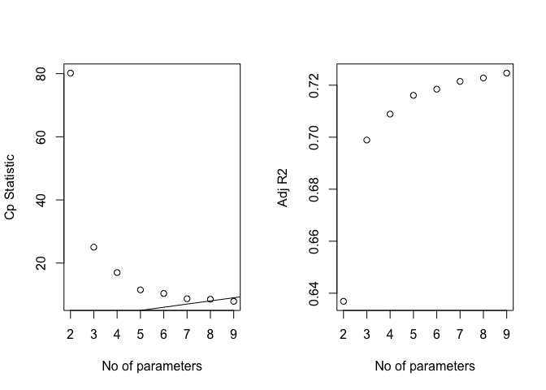

Final project
================

``` r
library(tidyverse)
```

    ## ── Attaching packages ─────────────────────────────────────── tidyverse 1.3.2 ──
    ## ✔ ggplot2 3.4.0      ✔ purrr   0.3.5 
    ## ✔ tibble  3.1.8      ✔ dplyr   1.0.10
    ## ✔ tidyr   1.2.0      ✔ stringr 1.4.1 
    ## ✔ readr   2.1.2      ✔ forcats 0.5.2 
    ## ── Conflicts ────────────────────────────────────────── tidyverse_conflicts() ──
    ## ✖ dplyr::filter() masks stats::filter()
    ## ✖ dplyr::lag()    masks stats::lag()

``` r
library(GGally)
```

    ## Registered S3 method overwritten by 'GGally':
    ##   method from   
    ##   +.gg   ggplot2

``` r
library(patchwork)
library(gt)
library(leaps)
library(caret)
```

    ## Loading required package: lattice
    ## 
    ## Attaching package: 'caret'
    ## 
    ## The following object is masked from 'package:purrr':
    ## 
    ##     lift

``` r
library(readxl)
library(patchwork)
library(glmnet)
```

    ## Loading required package: Matrix
    ## 
    ## Attaching package: 'Matrix'
    ## 
    ## The following objects are masked from 'package:tidyr':
    ## 
    ##     expand, pack, unpack
    ## 
    ## Loaded glmnet 4.1-4

``` r
library(performance)
```

## Import dataset

``` r
body_density_df = read_excel("data/body_density_data.xlsx") %>%
  rename(outcome = body_density) %>% 
  select(-bodyfat_siri & -bodyfat_brozek)
head(body_density_df)
```

    ## # A tibble: 6 × 15
    ##      id outcome   age weight height  neck chest abdomen   hip thigh  knee ankle
    ##   <dbl>   <dbl> <dbl>  <dbl>  <dbl> <dbl> <dbl>   <dbl> <dbl> <dbl> <dbl> <dbl>
    ## 1     1    1.07    23   154.   67.8  36.2  93.1    85.2  94.5  59    37.3  21.9
    ## 2     2    1.09    22   173.   72.2  38.5  93.6    83    98.7  58.7  37.3  23.4
    ## 3     3    1.04    22   154    66.2  34    95.8    87.9  99.2  59.6  38.9  24  
    ## 4     4    1.08    26   185.   72.2  37.4 102.     86.4 101.   60.1  37.3  22.8
    ## 5     5    1.03    24   184.   71.2  34.4  97.3   100   102.   63.2  42.2  24  
    ## 6     6    1.05    24   210.   74.8  39   104.     94.4 108.   66    42    25.6
    ## # … with 3 more variables: bicep <dbl>, forearm <dbl>, wrist <dbl>

## Descriptive statistics

``` r
body_density_df %>%
  gtsummary::tbl_summary() %>%
  gtsummary::bold_labels()
```

<div id="pquuivztgl" style="overflow-x:auto;overflow-y:auto;width:auto;height:auto;">
<style>html {
  font-family: -apple-system, BlinkMacSystemFont, 'Segoe UI', Roboto, Oxygen, Ubuntu, Cantarell, 'Helvetica Neue', 'Fira Sans', 'Droid Sans', Arial, sans-serif;
}

#pquuivztgl .gt_table {
  display: table;
  border-collapse: collapse;
  margin-left: auto;
  margin-right: auto;
  color: #333333;
  font-size: 16px;
  font-weight: normal;
  font-style: normal;
  background-color: #FFFFFF;
  width: auto;
  border-top-style: solid;
  border-top-width: 2px;
  border-top-color: #A8A8A8;
  border-right-style: none;
  border-right-width: 2px;
  border-right-color: #D3D3D3;
  border-bottom-style: solid;
  border-bottom-width: 2px;
  border-bottom-color: #A8A8A8;
  border-left-style: none;
  border-left-width: 2px;
  border-left-color: #D3D3D3;
}

#pquuivztgl .gt_heading {
  background-color: #FFFFFF;
  text-align: center;
  border-bottom-color: #FFFFFF;
  border-left-style: none;
  border-left-width: 1px;
  border-left-color: #D3D3D3;
  border-right-style: none;
  border-right-width: 1px;
  border-right-color: #D3D3D3;
}

#pquuivztgl .gt_title {
  color: #333333;
  font-size: 125%;
  font-weight: initial;
  padding-top: 4px;
  padding-bottom: 4px;
  padding-left: 5px;
  padding-right: 5px;
  border-bottom-color: #FFFFFF;
  border-bottom-width: 0;
}

#pquuivztgl .gt_subtitle {
  color: #333333;
  font-size: 85%;
  font-weight: initial;
  padding-top: 0;
  padding-bottom: 6px;
  padding-left: 5px;
  padding-right: 5px;
  border-top-color: #FFFFFF;
  border-top-width: 0;
}

#pquuivztgl .gt_bottom_border {
  border-bottom-style: solid;
  border-bottom-width: 2px;
  border-bottom-color: #D3D3D3;
}

#pquuivztgl .gt_col_headings {
  border-top-style: solid;
  border-top-width: 2px;
  border-top-color: #D3D3D3;
  border-bottom-style: solid;
  border-bottom-width: 2px;
  border-bottom-color: #D3D3D3;
  border-left-style: none;
  border-left-width: 1px;
  border-left-color: #D3D3D3;
  border-right-style: none;
  border-right-width: 1px;
  border-right-color: #D3D3D3;
}

#pquuivztgl .gt_col_heading {
  color: #333333;
  background-color: #FFFFFF;
  font-size: 100%;
  font-weight: normal;
  text-transform: inherit;
  border-left-style: none;
  border-left-width: 1px;
  border-left-color: #D3D3D3;
  border-right-style: none;
  border-right-width: 1px;
  border-right-color: #D3D3D3;
  vertical-align: bottom;
  padding-top: 5px;
  padding-bottom: 6px;
  padding-left: 5px;
  padding-right: 5px;
  overflow-x: hidden;
}

#pquuivztgl .gt_column_spanner_outer {
  color: #333333;
  background-color: #FFFFFF;
  font-size: 100%;
  font-weight: normal;
  text-transform: inherit;
  padding-top: 0;
  padding-bottom: 0;
  padding-left: 4px;
  padding-right: 4px;
}

#pquuivztgl .gt_column_spanner_outer:first-child {
  padding-left: 0;
}

#pquuivztgl .gt_column_spanner_outer:last-child {
  padding-right: 0;
}

#pquuivztgl .gt_column_spanner {
  border-bottom-style: solid;
  border-bottom-width: 2px;
  border-bottom-color: #D3D3D3;
  vertical-align: bottom;
  padding-top: 5px;
  padding-bottom: 5px;
  overflow-x: hidden;
  display: inline-block;
  width: 100%;
}

#pquuivztgl .gt_group_heading {
  padding-top: 8px;
  padding-bottom: 8px;
  padding-left: 5px;
  padding-right: 5px;
  color: #333333;
  background-color: #FFFFFF;
  font-size: 100%;
  font-weight: initial;
  text-transform: inherit;
  border-top-style: solid;
  border-top-width: 2px;
  border-top-color: #D3D3D3;
  border-bottom-style: solid;
  border-bottom-width: 2px;
  border-bottom-color: #D3D3D3;
  border-left-style: none;
  border-left-width: 1px;
  border-left-color: #D3D3D3;
  border-right-style: none;
  border-right-width: 1px;
  border-right-color: #D3D3D3;
  vertical-align: middle;
}

#pquuivztgl .gt_empty_group_heading {
  padding: 0.5px;
  color: #333333;
  background-color: #FFFFFF;
  font-size: 100%;
  font-weight: initial;
  border-top-style: solid;
  border-top-width: 2px;
  border-top-color: #D3D3D3;
  border-bottom-style: solid;
  border-bottom-width: 2px;
  border-bottom-color: #D3D3D3;
  vertical-align: middle;
}

#pquuivztgl .gt_from_md > :first-child {
  margin-top: 0;
}

#pquuivztgl .gt_from_md > :last-child {
  margin-bottom: 0;
}

#pquuivztgl .gt_row {
  padding-top: 8px;
  padding-bottom: 8px;
  padding-left: 5px;
  padding-right: 5px;
  margin: 10px;
  border-top-style: solid;
  border-top-width: 1px;
  border-top-color: #D3D3D3;
  border-left-style: none;
  border-left-width: 1px;
  border-left-color: #D3D3D3;
  border-right-style: none;
  border-right-width: 1px;
  border-right-color: #D3D3D3;
  vertical-align: middle;
  overflow-x: hidden;
}

#pquuivztgl .gt_stub {
  color: #333333;
  background-color: #FFFFFF;
  font-size: 100%;
  font-weight: initial;
  text-transform: inherit;
  border-right-style: solid;
  border-right-width: 2px;
  border-right-color: #D3D3D3;
  padding-left: 5px;
  padding-right: 5px;
}

#pquuivztgl .gt_stub_row_group {
  color: #333333;
  background-color: #FFFFFF;
  font-size: 100%;
  font-weight: initial;
  text-transform: inherit;
  border-right-style: solid;
  border-right-width: 2px;
  border-right-color: #D3D3D3;
  padding-left: 5px;
  padding-right: 5px;
  vertical-align: top;
}

#pquuivztgl .gt_row_group_first td {
  border-top-width: 2px;
}

#pquuivztgl .gt_summary_row {
  color: #333333;
  background-color: #FFFFFF;
  text-transform: inherit;
  padding-top: 8px;
  padding-bottom: 8px;
  padding-left: 5px;
  padding-right: 5px;
}

#pquuivztgl .gt_first_summary_row {
  border-top-style: solid;
  border-top-color: #D3D3D3;
}

#pquuivztgl .gt_first_summary_row.thick {
  border-top-width: 2px;
}

#pquuivztgl .gt_last_summary_row {
  padding-top: 8px;
  padding-bottom: 8px;
  padding-left: 5px;
  padding-right: 5px;
  border-bottom-style: solid;
  border-bottom-width: 2px;
  border-bottom-color: #D3D3D3;
}

#pquuivztgl .gt_grand_summary_row {
  color: #333333;
  background-color: #FFFFFF;
  text-transform: inherit;
  padding-top: 8px;
  padding-bottom: 8px;
  padding-left: 5px;
  padding-right: 5px;
}

#pquuivztgl .gt_first_grand_summary_row {
  padding-top: 8px;
  padding-bottom: 8px;
  padding-left: 5px;
  padding-right: 5px;
  border-top-style: double;
  border-top-width: 6px;
  border-top-color: #D3D3D3;
}

#pquuivztgl .gt_striped {
  background-color: rgba(128, 128, 128, 0.05);
}

#pquuivztgl .gt_table_body {
  border-top-style: solid;
  border-top-width: 2px;
  border-top-color: #D3D3D3;
  border-bottom-style: solid;
  border-bottom-width: 2px;
  border-bottom-color: #D3D3D3;
}

#pquuivztgl .gt_footnotes {
  color: #333333;
  background-color: #FFFFFF;
  border-bottom-style: none;
  border-bottom-width: 2px;
  border-bottom-color: #D3D3D3;
  border-left-style: none;
  border-left-width: 2px;
  border-left-color: #D3D3D3;
  border-right-style: none;
  border-right-width: 2px;
  border-right-color: #D3D3D3;
}

#pquuivztgl .gt_footnote {
  margin: 0px;
  font-size: 90%;
  padding-left: 4px;
  padding-right: 4px;
  padding-left: 5px;
  padding-right: 5px;
}

#pquuivztgl .gt_sourcenotes {
  color: #333333;
  background-color: #FFFFFF;
  border-bottom-style: none;
  border-bottom-width: 2px;
  border-bottom-color: #D3D3D3;
  border-left-style: none;
  border-left-width: 2px;
  border-left-color: #D3D3D3;
  border-right-style: none;
  border-right-width: 2px;
  border-right-color: #D3D3D3;
}

#pquuivztgl .gt_sourcenote {
  font-size: 90%;
  padding-top: 4px;
  padding-bottom: 4px;
  padding-left: 5px;
  padding-right: 5px;
}

#pquuivztgl .gt_left {
  text-align: left;
}

#pquuivztgl .gt_center {
  text-align: center;
}

#pquuivztgl .gt_right {
  text-align: right;
  font-variant-numeric: tabular-nums;
}

#pquuivztgl .gt_font_normal {
  font-weight: normal;
}

#pquuivztgl .gt_font_bold {
  font-weight: bold;
}

#pquuivztgl .gt_font_italic {
  font-style: italic;
}

#pquuivztgl .gt_super {
  font-size: 65%;
}

#pquuivztgl .gt_footnote_marks {
  font-style: italic;
  font-weight: normal;
  font-size: 75%;
  vertical-align: 0.4em;
}

#pquuivztgl .gt_asterisk {
  font-size: 100%;
  vertical-align: 0;
}

#pquuivztgl .gt_indent_1 {
  text-indent: 5px;
}

#pquuivztgl .gt_indent_2 {
  text-indent: 10px;
}

#pquuivztgl .gt_indent_3 {
  text-indent: 15px;
}

#pquuivztgl .gt_indent_4 {
  text-indent: 20px;
}

#pquuivztgl .gt_indent_5 {
  text-indent: 25px;
}
</style>
<table class="gt_table">
  
  <thead class="gt_col_headings">
    <tr>
      <th class="gt_col_heading gt_columns_bottom_border gt_left" rowspan="1" colspan="1" scope="col"><strong>Characteristic</strong></th>
      <th class="gt_col_heading gt_columns_bottom_border gt_center" rowspan="1" colspan="1" scope="col"><strong>N = 252</strong><sup class="gt_footnote_marks">1</sup></th>
    </tr>
  </thead>
  <tbody class="gt_table_body">
    <tr><td class="gt_row gt_left" style="font-weight: bold;">id</td>
<td class="gt_row gt_center">126 (64, 189)</td></tr>
    <tr><td class="gt_row gt_left" style="font-weight: bold;">outcome</td>
<td class="gt_row gt_center">1.055 (1.041, 1.070)</td></tr>
    <tr><td class="gt_row gt_left" style="font-weight: bold;">age</td>
<td class="gt_row gt_center">43 (36, 54)</td></tr>
    <tr><td class="gt_row gt_left" style="font-weight: bold;">weight</td>
<td class="gt_row gt_center">176 (159, 197)</td></tr>
    <tr><td class="gt_row gt_left" style="font-weight: bold;">height</td>
<td class="gt_row gt_center">70.00 (68.25, 72.25)</td></tr>
    <tr><td class="gt_row gt_left" style="font-weight: bold;">neck</td>
<td class="gt_row gt_center">38.00 (36.40, 39.42)</td></tr>
    <tr><td class="gt_row gt_left" style="font-weight: bold;">chest</td>
<td class="gt_row gt_center">100 (94, 105)</td></tr>
    <tr><td class="gt_row gt_left" style="font-weight: bold;">abdomen</td>
<td class="gt_row gt_center">91 (85, 99)</td></tr>
    <tr><td class="gt_row gt_left" style="font-weight: bold;">hip</td>
<td class="gt_row gt_center">99 (96, 104)</td></tr>
    <tr><td class="gt_row gt_left" style="font-weight: bold;">thigh</td>
<td class="gt_row gt_center">59.0 (56.0, 62.3)</td></tr>
    <tr><td class="gt_row gt_left" style="font-weight: bold;">knee</td>
<td class="gt_row gt_center">38.50 (36.98, 39.92)</td></tr>
    <tr><td class="gt_row gt_left" style="font-weight: bold;">ankle</td>
<td class="gt_row gt_center">22.80 (22.00, 24.00)</td></tr>
    <tr><td class="gt_row gt_left" style="font-weight: bold;">bicep</td>
<td class="gt_row gt_center">32.05 (30.20, 34.32)</td></tr>
    <tr><td class="gt_row gt_left" style="font-weight: bold;">forearm</td>
<td class="gt_row gt_center">28.70 (27.30, 30.00)</td></tr>
    <tr><td class="gt_row gt_left" style="font-weight: bold;">wrist</td>
<td class="gt_row gt_center">18.30 (17.60, 18.80)</td></tr>
  </tbody>
  
  <tfoot class="gt_footnotes">
    <tr>
      <td class="gt_footnote" colspan="2"><sup class="gt_footnote_marks">1</sup> Median (IQR)</td>
    </tr>
  </tfoot>
</table>
</div>

``` r
summary(body_density_df)
```

    ##        id            outcome           age            weight     
    ##  Min.   :  1.00   Min.   :0.995   Min.   :22.00   Min.   :118.5  
    ##  1st Qu.: 63.75   1st Qu.:1.041   1st Qu.:35.75   1st Qu.:159.0  
    ##  Median :126.50   Median :1.055   Median :43.00   Median :176.5  
    ##  Mean   :126.50   Mean   :1.056   Mean   :44.88   Mean   :178.9  
    ##  3rd Qu.:189.25   3rd Qu.:1.070   3rd Qu.:54.00   3rd Qu.:197.0  
    ##  Max.   :252.00   Max.   :1.109   Max.   :81.00   Max.   :363.1  
    ##      height           neck           chest           abdomen      
    ##  Min.   :64.00   Min.   :31.10   Min.   : 79.30   Min.   : 69.40  
    ##  1st Qu.:68.25   1st Qu.:36.40   1st Qu.: 94.35   1st Qu.: 84.58  
    ##  Median :70.00   Median :38.00   Median : 99.65   Median : 90.95  
    ##  Mean   :70.31   Mean   :37.99   Mean   :100.82   Mean   : 92.56  
    ##  3rd Qu.:72.25   3rd Qu.:39.42   3rd Qu.:105.38   3rd Qu.: 99.33  
    ##  Max.   :77.75   Max.   :51.20   Max.   :136.20   Max.   :148.10  
    ##       hip            thigh            knee           ankle          bicep      
    ##  Min.   : 85.0   Min.   :47.20   Min.   :33.00   Min.   :19.1   Min.   :24.80  
    ##  1st Qu.: 95.5   1st Qu.:56.00   1st Qu.:36.98   1st Qu.:22.0   1st Qu.:30.20  
    ##  Median : 99.3   Median :59.00   Median :38.50   Median :22.8   Median :32.05  
    ##  Mean   : 99.9   Mean   :59.41   Mean   :38.59   Mean   :23.1   Mean   :32.27  
    ##  3rd Qu.:103.5   3rd Qu.:62.35   3rd Qu.:39.92   3rd Qu.:24.0   3rd Qu.:34.33  
    ##  Max.   :147.7   Max.   :87.30   Max.   :49.10   Max.   :33.9   Max.   :45.00  
    ##     forearm          wrist      
    ##  Min.   :21.00   Min.   :15.80  
    ##  1st Qu.:27.30   1st Qu.:17.60  
    ##  Median :28.70   Median :18.30  
    ##  Mean   :28.66   Mean   :18.23  
    ##  3rd Qu.:30.00   3rd Qu.:18.80  
    ##  Max.   :34.90   Max.   :21.40

## Exploratory plots

### correlation plot

``` r
correlation_plot = body_density_df %>%
  relocate(outcome) %>%
  ggpairs()
  ggsave("./correlation.png",correlation_plot, width = 8, height = 5)
```

### Histogram plot for outcome

``` r
hist_outcome = body_density_df %>% 
  ggplot(aes(x = outcome)) +
  geom_histogram()
hist_outcome
```

    ## `stat_bin()` using `bins = 30`. Pick better value with `binwidth`.

<!-- -->

## Fitting a full model

``` r
full_model = lm(outcome ~ ., data = body_density_df)
summary(full_model)
```

    ## 
    ## Call:
    ## lm(formula = outcome ~ ., data = body_density_df)
    ## 
    ## Residuals:
    ##       Min        1Q    Median        3Q       Max 
    ## -0.021914 -0.007465  0.000245  0.006617  0.034495 
    ## 
    ## Coefficients:
    ##               Estimate Std. Error t value Pr(>|t|)    
    ## (Intercept)  1.142e+00  5.162e-02  22.113  < 2e-16 ***
    ## id           4.965e-06  9.463e-06   0.525  0.60033    
    ## age         -1.324e-04  7.612e-05  -1.739  0.08327 .  
    ## weight       2.469e-04  1.439e-04   1.715  0.08766 .  
    ## height       1.183e-04  4.161e-04   0.284  0.77649    
    ## neck         1.093e-03  5.480e-04   1.994  0.04728 *  
    ## chest        1.095e-04  2.404e-04   0.455  0.64923    
    ## abdomen     -2.278e-03  2.100e-04 -10.845  < 2e-16 ***
    ## hip          5.360e-04  3.389e-04   1.582  0.11506    
    ## thigh       -6.273e-04  3.403e-04  -1.843  0.06654 .  
    ## knee        -7.810e-05  5.779e-04  -0.135  0.89260    
    ## ankle       -6.133e-04  5.195e-04  -1.180  0.23903    
    ## bicep       -5.642e-04  4.016e-04  -1.405  0.16139    
    ## forearm     -1.028e-03  4.636e-04  -2.217  0.02758 *  
    ## wrist        4.044e-03  1.241e-03   3.260  0.00128 ** 
    ## ---
    ## Signif. codes:  0 '***' 0.001 '**' 0.01 '*' 0.05 '.' 0.1 ' ' 1
    ## 
    ## Residual standard error: 0.01002 on 237 degrees of freedom
    ## Multiple R-squared:  0.738,  Adjusted R-squared:  0.7225 
    ## F-statistic: 47.69 on 14 and 237 DF,  p-value: < 2.2e-16

## Model selection

### Forward selection

``` r
intercept_only <- lm(outcome ~ 1, data = body_density_df)
fit_forward = step(intercept_only, direction = "forward", scope = formula(full_model))
```

    ## Start:  AIC=-1995.68
    ## outcome ~ 1
    ## 
    ##           Df Sum of Sq      RSS     AIC
    ## + abdomen  1  0.058031 0.032880 -2250.0
    ## + chest    1  0.042359 0.048552 -2151.8
    ## + hip      1  0.033754 0.057157 -2110.6
    ## + weight   1  0.032083 0.058828 -2103.4
    ## + thigh    1  0.027811 0.063100 -2085.7
    ## + knee     1  0.022279 0.068632 -2064.5
    ## + bicep    1  0.021571 0.069340 -2061.9
    ## + neck     1  0.020337 0.070575 -2057.5
    ## + forearm  1  0.011242 0.079669 -2026.9
    ## + wrist    1  0.009645 0.081266 -2021.9
    ## + age      1  0.007008 0.083903 -2013.9
    ## + ankle    1  0.006379 0.084532 -2012.0
    ## + id       1  0.001092 0.089819 -1996.7
    ## <none>                 0.090911 -1995.7
    ## + height   1  0.000140 0.090771 -1994.1
    ## 
    ## Step:  AIC=-2249.97
    ## outcome ~ abdomen
    ## 
    ##           Df Sum of Sq      RSS     AIC
    ## + weight   1 0.0057258 0.027154 -2296.2
    ## + wrist    1 0.0042415 0.028638 -2282.8
    ## + neck     1 0.0035347 0.029345 -2276.6
    ## + height   1 0.0034367 0.029443 -2275.8
    ## + hip      1 0.0030517 0.029828 -2272.5
    ## + knee     1 0.0017569 0.031123 -2261.8
    ## + chest    1 0.0013594 0.031520 -2258.6
    ## + ankle    1 0.0010813 0.031799 -2256.4
    ## + age      1 0.0008402 0.032040 -2254.5
    ## + thigh    1 0.0007782 0.032102 -2254.0
    ## + bicep    1 0.0006199 0.032260 -2252.8
    ## + forearm  1 0.0003102 0.032570 -2250.4
    ## <none>                 0.032880 -2250.0
    ## + id       1 0.0000141 0.032866 -2248.1
    ## 
    ## Step:  AIC=-2296.18
    ## outcome ~ abdomen + weight
    ## 
    ##           Df  Sum of Sq      RSS     AIC
    ## + wrist    1 0.00100555 0.026149 -2303.7
    ## + thigh    1 0.00069040 0.026464 -2300.7
    ## + bicep    1 0.00051011 0.026644 -2299.0
    ## + neck     1 0.00050946 0.026645 -2299.0
    ## + forearm  1 0.00038040 0.026774 -2297.7
    ## <none>                  0.027154 -2296.2
    ## + age      1 0.00007895 0.027075 -2294.9
    ## + id       1 0.00007551 0.027079 -2294.9
    ## + knee     1 0.00007007 0.027084 -2294.8
    ## + height   1 0.00005514 0.027099 -2294.7
    ## + ankle    1 0.00005081 0.027103 -2294.7
    ## + chest    1 0.00001698 0.027137 -2294.3
    ## + hip      1 0.00000066 0.027154 -2294.2
    ## 
    ## Step:  AIC=-2303.69
    ## outcome ~ abdomen + weight + wrist
    ## 
    ##           Df  Sum of Sq      RSS     AIC
    ## + forearm  1 0.00075008 0.025399 -2309.0
    ## + bicep    1 0.00068754 0.025461 -2308.4
    ## + thigh    1 0.00038582 0.025763 -2305.4
    ## <none>                  0.026149 -2303.7
    ## + ankle    1 0.00019290 0.025956 -2303.6
    ## + knee     1 0.00014287 0.026006 -2303.1
    ## + neck     1 0.00013465 0.026014 -2303.0
    ## + height   1 0.00004558 0.026103 -2302.1
    ## + hip      1 0.00004433 0.026104 -2302.1
    ## + age      1 0.00003201 0.026117 -2302.0
    ## + id       1 0.00002933 0.026119 -2302.0
    ## + chest    1 0.00000110 0.026148 -2301.7
    ## 
    ## Step:  AIC=-2309.03
    ## outcome ~ abdomen + weight + wrist + forearm
    ## 
    ##          Df  Sum of Sq      RSS     AIC
    ## + bicep   1 3.1451e-04 0.025084 -2310.2
    ## + thigh   1 2.8539e-04 0.025113 -2309.9
    ## + neck    1 2.8054e-04 0.025118 -2309.8
    ## + ankle   1 2.2026e-04 0.025178 -2309.2
    ## <none>                 0.025399 -2309.0
    ## + knee    1 1.3829e-04 0.025260 -2308.4
    ## + age     1 8.9663e-05 0.025309 -2307.9
    ## + chest   1 3.0326e-05 0.025368 -2307.3
    ## + id      1 2.4452e-05 0.025374 -2307.3
    ## + height  1 1.6199e-05 0.025382 -2307.2
    ## + hip     1 1.4807e-05 0.025384 -2307.2
    ## 
    ## Step:  AIC=-2310.17
    ## outcome ~ abdomen + weight + wrist + forearm + bicep
    ## 
    ##          Df  Sum of Sq      RSS     AIC
    ## + neck    1 0.00036636 0.024718 -2311.9
    ## + ankle   1 0.00025025 0.024834 -2310.7
    ## <none>                 0.025084 -2310.2
    ## + thigh   1 0.00017170 0.024912 -2309.9
    ## + knee    1 0.00015528 0.024929 -2309.7
    ## + age     1 0.00009321 0.024991 -2309.1
    ## + chest   1 0.00004448 0.025040 -2308.6
    ## + hip     1 0.00001697 0.025067 -2308.3
    ## + id      1 0.00001456 0.025070 -2308.3
    ## + height  1 0.00000000 0.025084 -2308.2
    ## 
    ## Step:  AIC=-2311.88
    ## outcome ~ abdomen + weight + wrist + forearm + bicep + neck
    ## 
    ##          Df  Sum of Sq      RSS     AIC
    ## <none>                 0.024718 -2311.9
    ## + ankle   1 1.7676e-04 0.024541 -2311.7
    ## + thigh   1 1.4301e-04 0.024575 -2311.3
    ## + age     1 1.3500e-04 0.024583 -2311.3
    ## + knee    1 8.5366e-05 0.024632 -2310.8
    ## + hip     1 6.4373e-05 0.024653 -2310.5
    ## + chest   1 2.2083e-05 0.024696 -2310.1
    ## + id      1 9.1190e-06 0.024709 -2310.0
    ## + height  1 8.5180e-06 0.024709 -2310.0

### Backward Elimination

``` r
fit_backward = step(lm(full_model, data = body_density_df), direction = "backward")
```

    ## Start:  AIC=-2305.22
    ## outcome ~ id + age + weight + height + neck + chest + abdomen + 
    ##     hip + thigh + knee + ankle + bicep + forearm + wrist
    ## 
    ##           Df Sum of Sq      RSS     AIC
    ## - knee     1 0.0000018 0.023819 -2307.2
    ## - height   1 0.0000081 0.023826 -2307.1
    ## - chest    1 0.0000208 0.023838 -2307.0
    ## - id       1 0.0000277 0.023845 -2306.9
    ## - ankle    1 0.0001400 0.023958 -2305.8
    ## <none>                 0.023818 -2305.2
    ## - bicep    1 0.0001983 0.024016 -2305.1
    ## - hip      1 0.0002514 0.024069 -2304.6
    ## - weight   1 0.0002956 0.024113 -2304.1
    ## - age      1 0.0003040 0.024122 -2304.0
    ## - thigh    1 0.0003415 0.024159 -2303.6
    ## - neck     1 0.0003996 0.024217 -2303.0
    ## - forearm  1 0.0004939 0.024311 -2302.1
    ## - wrist    1 0.0010679 0.024885 -2296.2
    ## - abdomen  1 0.0118197 0.035637 -2205.7
    ## 
    ## Step:  AIC=-2307.2
    ## outcome ~ id + age + weight + height + neck + chest + abdomen + 
    ##     hip + thigh + ankle + bicep + forearm + wrist
    ## 
    ##           Df Sum of Sq      RSS     AIC
    ## - height   1 0.0000068 0.023826 -2309.1
    ## - chest    1 0.0000212 0.023841 -2309.0
    ## - id       1 0.0000268 0.023846 -2308.9
    ## - ankle    1 0.0001514 0.023971 -2307.6
    ## <none>                 0.023819 -2307.2
    ## - bicep    1 0.0001970 0.024016 -2307.1
    ## - hip      1 0.0002496 0.024069 -2306.6
    ## - weight   1 0.0002939 0.024113 -2306.1
    ## - age      1 0.0003338 0.024153 -2305.7
    ## - thigh    1 0.0003952 0.024215 -2305.1
    ## - neck     1 0.0004108 0.024230 -2304.9
    ## - forearm  1 0.0005022 0.024322 -2303.9
    ## - wrist    1 0.0010673 0.024887 -2298.2
    ## - abdomen  1 0.0118180 0.035637 -2207.7
    ## 
    ## Step:  AIC=-2309.13
    ## outcome ~ id + age + weight + neck + chest + abdomen + hip + 
    ##     thigh + ankle + bicep + forearm + wrist
    ## 
    ##           Df Sum of Sq      RSS     AIC
    ## - chest    1 0.0000154 0.023842 -2311.0
    ## - id       1 0.0000286 0.023855 -2310.8
    ## - ankle    1 0.0001565 0.023983 -2309.5
    ## <none>                 0.023826 -2309.1
    ## - bicep    1 0.0002115 0.024038 -2308.9
    ## - hip      1 0.0002431 0.024069 -2308.6
    ## - age      1 0.0003376 0.024164 -2307.6
    ## - neck     1 0.0004054 0.024232 -2306.9
    ## - thigh    1 0.0004319 0.024258 -2306.6
    ## - forearm  1 0.0004989 0.024325 -2305.9
    ## - weight   1 0.0006595 0.024486 -2304.2
    ## - wrist    1 0.0010796 0.024906 -2300.0
    ## - abdomen  1 0.0132853 0.037112 -2199.5
    ## 
    ## Step:  AIC=-2310.97
    ## outcome ~ id + age + weight + neck + abdomen + hip + thigh + 
    ##     ankle + bicep + forearm + wrist
    ## 
    ##           Df Sum of Sq      RSS     AIC
    ## - id       1 0.0000296 0.023871 -2312.7
    ## - ankle    1 0.0001594 0.024001 -2311.3
    ## <none>                 0.023842 -2311.0
    ## - bicep    1 0.0002020 0.024044 -2310.8
    ## - hip      1 0.0002311 0.024073 -2310.5
    ## - age      1 0.0003330 0.024175 -2309.5
    ## - neck     1 0.0004158 0.024257 -2308.6
    ## - thigh    1 0.0004685 0.024310 -2308.1
    ## - forearm  1 0.0004853 0.024327 -2307.9
    ## - weight   1 0.0008229 0.024665 -2304.4
    ## - wrist    1 0.0010696 0.024911 -2301.9
    ## - abdomen  1 0.0175514 0.041393 -2173.9
    ## 
    ## Step:  AIC=-2312.66
    ## outcome ~ age + weight + neck + abdomen + hip + thigh + ankle + 
    ##     bicep + forearm + wrist
    ## 
    ##           Df Sum of Sq      RSS     AIC
    ## - ankle    1 0.0001706 0.024042 -2312.9
    ## <none>                 0.023871 -2312.7
    ## - bicep    1 0.0002106 0.024082 -2312.4
    ## - hip      1 0.0002142 0.024085 -2312.4
    ## - age      1 0.0003066 0.024178 -2311.4
    ## - neck     1 0.0004116 0.024283 -2310.3
    ## - thigh    1 0.0004774 0.024349 -2309.7
    ## - forearm  1 0.0004804 0.024352 -2309.6
    ## - weight   1 0.0008772 0.024748 -2305.6
    ## - wrist    1 0.0010639 0.024935 -2303.7
    ## - abdomen  1 0.0175263 0.041397 -2175.9
    ## 
    ## Step:  AIC=-2312.86
    ## outcome ~ age + weight + neck + abdomen + hip + thigh + bicep + 
    ##     forearm + wrist
    ## 
    ##           Df Sum of Sq      RSS     AIC
    ## <none>                 0.024042 -2312.9
    ## - bicep    1 0.0001923 0.024234 -2312.8
    ## - hip      1 0.0002267 0.024269 -2312.5
    ## - age      1 0.0002803 0.024322 -2311.9
    ## - forearm  1 0.0004752 0.024517 -2309.9
    ## - neck     1 0.0004938 0.024536 -2309.7
    ## - thigh    1 0.0005100 0.024552 -2309.6
    ## - weight   1 0.0007406 0.024782 -2307.2
    ## - wrist    1 0.0009172 0.024959 -2305.4
    ## - abdomen  1 0.0173814 0.041423 -2177.8

### Stepwise selection

``` r
step(
lm(outcome ~ age + weight + height + neck + chest + abdomen + hip + knee + ankle + bicep + forearm + wrist,
data = body_density_df),
direction = "both"
) 
```

    ## Start:  AIC=-2305.26
    ## outcome ~ age + weight + height + neck + chest + abdomen + hip + 
    ##     knee + ankle + bicep + forearm + wrist
    ## 
    ##           Df Sum of Sq      RSS     AIC
    ## - knee     1 0.0000502 0.024245 -2306.7
    ## - height   1 0.0000646 0.024260 -2306.6
    ## - chest    1 0.0000743 0.024269 -2306.5
    ## - hip      1 0.0000983 0.024293 -2306.2
    ## - age      1 0.0001168 0.024312 -2306.1
    ## - ankle    1 0.0001399 0.024335 -2305.8
    ## <none>                 0.024195 -2305.3
    ## - weight   1 0.0002275 0.024423 -2304.9
    ## - neck     1 0.0003515 0.024547 -2303.6
    ## - bicep    1 0.0003763 0.024571 -2303.4
    ## - forearm  1 0.0005060 0.024701 -2302.0
    ## - wrist    1 0.0011596 0.025355 -2295.5
    ## - abdomen  1 0.0121716 0.036367 -2204.6
    ## 
    ## Step:  AIC=-2306.74
    ## outcome ~ age + weight + height + neck + chest + abdomen + hip + 
    ##     ankle + bicep + forearm + wrist
    ## 
    ##           Df Sum of Sq      RSS     AIC
    ## - height   1 0.0000488 0.024294 -2308.2
    ## - hip      1 0.0000765 0.024322 -2307.9
    ## - chest    1 0.0000861 0.024331 -2307.8
    ## - age      1 0.0001466 0.024392 -2307.2
    ## - ankle    1 0.0001785 0.024424 -2306.9
    ## <none>                 0.024245 -2306.7
    ## - weight   1 0.0002006 0.024446 -2306.7
    ## + knee     1 0.0000502 0.024195 -2305.3
    ## - neck     1 0.0003807 0.024626 -2304.8
    ## - bicep    1 0.0003840 0.024629 -2304.8
    ## - forearm  1 0.0005407 0.024786 -2303.2
    ## - wrist    1 0.0011370 0.025382 -2297.2
    ## - abdomen  1 0.0122056 0.036451 -2206.0
    ## 
    ## Step:  AIC=-2308.23
    ## outcome ~ age + weight + neck + chest + abdomen + hip + ankle + 
    ##     bicep + forearm + wrist
    ## 
    ##           Df Sum of Sq      RSS     AIC
    ## - hip      1 0.0000483 0.024342 -2309.7
    ## - chest    1 0.0000546 0.024349 -2309.7
    ## - age      1 0.0001403 0.024434 -2308.8
    ## <none>                 0.024294 -2308.2
    ## - ankle    1 0.0001950 0.024489 -2308.2
    ## + height   1 0.0000488 0.024245 -2306.7
    ## - neck     1 0.0003418 0.024636 -2306.7
    ## + knee     1 0.0000344 0.024260 -2306.6
    ## - bicep    1 0.0004586 0.024753 -2305.5
    ## - forearm  1 0.0005328 0.024827 -2304.8
    ## - weight   1 0.0006444 0.024938 -2303.6
    ## - wrist    1 0.0011726 0.025467 -2298.3
    ## - abdomen  1 0.0142989 0.038593 -2193.6
    ## 
    ## Step:  AIC=-2309.73
    ## outcome ~ age + weight + neck + chest + abdomen + ankle + bicep + 
    ##     forearm + wrist
    ## 
    ##           Df Sum of Sq      RSS     AIC
    ## - chest    1 0.0000357 0.024378 -2311.4
    ## - age      1 0.0001819 0.024524 -2309.9
    ## <none>                 0.024342 -2309.7
    ## - ankle    1 0.0001984 0.024541 -2309.7
    ## - neck     1 0.0003095 0.024652 -2308.6
    ## + hip      1 0.0000483 0.024294 -2308.2
    ## + knee     1 0.0000230 0.024319 -2308.0
    ## + height   1 0.0000206 0.024322 -2307.9
    ## - bicep    1 0.0004451 0.024787 -2307.2
    ## - forearm  1 0.0005633 0.024906 -2306.0
    ## - wrist    1 0.0011576 0.025500 -2300.0
    ## - weight   1 0.0013965 0.025739 -2297.7
    ## - abdomen  1 0.0160540 0.040396 -2184.1
    ## 
    ## Step:  AIC=-2311.36
    ## outcome ~ age + weight + neck + abdomen + ankle + bicep + forearm + 
    ##     wrist
    ## 
    ##           Df Sum of Sq      RSS     AIC
    ## - age      1 0.0001628 0.024541 -2311.7
    ## <none>                 0.024378 -2311.4
    ## - ankle    1 0.0002046 0.024583 -2311.3
    ## - neck     1 0.0003300 0.024708 -2310.0
    ## + chest    1 0.0000357 0.024342 -2309.7
    ## + knee     1 0.0000337 0.024344 -2309.7
    ## + hip      1 0.0000294 0.024349 -2309.7
    ## + height   1 0.0000079 0.024370 -2309.4
    ## - bicep    1 0.0004328 0.024811 -2308.9
    ## - forearm  1 0.0005354 0.024914 -2307.9
    ## - wrist    1 0.0011455 0.025524 -2301.8
    ## - weight   1 0.0016261 0.026004 -2297.1
    ## - abdomen  1 0.0197005 0.044079 -2164.1
    ## 
    ## Step:  AIC=-2311.68
    ## outcome ~ weight + neck + abdomen + ankle + bicep + forearm + 
    ##     wrist
    ## 
    ##           Df Sum of Sq      RSS     AIC
    ## - ankle    1 0.0001768 0.024718 -2311.9
    ## <none>                 0.024541 -2311.7
    ## + age      1 0.0001628 0.024378 -2311.4
    ## - neck     1 0.0002929 0.024834 -2310.7
    ## + hip      1 0.0000666 0.024474 -2310.4
    ## + knee     1 0.0000519 0.024489 -2310.2
    ## + chest    1 0.0000167 0.024524 -2309.9
    ## + height   1 0.0000043 0.024537 -2309.7
    ## - bicep    1 0.0004194 0.024960 -2309.4
    ## - forearm  1 0.0004668 0.025008 -2308.9
    ## - wrist    1 0.0009851 0.025526 -2303.8
    ## - weight   1 0.0028554 0.027396 -2285.9
    ## - abdomen  1 0.0311143 0.055655 -2107.3
    ## 
    ## Step:  AIC=-2311.88
    ## outcome ~ weight + neck + abdomen + bicep + forearm + wrist
    ## 
    ##           Df Sum of Sq      RSS     AIC
    ## <none>                 0.024718 -2311.9
    ## + ankle    1  0.000177 0.024541 -2311.7
    ## + age      1  0.000135 0.024583 -2311.3
    ## + knee     1  0.000085 0.024632 -2310.8
    ## + hip      1  0.000064 0.024653 -2310.5
    ## - neck     1  0.000366 0.025084 -2310.2
    ## + chest    1  0.000022 0.024696 -2310.1
    ## + height   1  0.000009 0.024709 -2310.0
    ## - bicep    1  0.000400 0.025118 -2309.8
    ## - forearm  1  0.000469 0.025187 -2309.1
    ## - wrist    1  0.000843 0.025561 -2305.4
    ## - weight   1  0.002751 0.027468 -2287.3
    ## - abdomen  1  0.031689 0.056407 -2106.0

    ## 
    ## Call:
    ## lm(formula = outcome ~ weight + neck + abdomen + bicep + forearm + 
    ##     wrist, data = body_density_df)
    ## 
    ## Coefficients:
    ## (Intercept)       weight         neck      abdomen        bicep      forearm  
    ##   1.1680224    0.0003356    0.0009874   -0.0023211   -0.0007586   -0.0009754  
    ##       wrist  
    ##   0.0031416

``` r
stepwise_model = lm(outcome ~ weight + neck + abdomen + bicep + forearm + wrist,data = body_density_df)
```

### Criteria-based Selection

Plot

``` r
b = regsubsets(outcome ~ 
                 age + weight + height + neck + chest + abdomen + hip + thigh +
                 knee + ankle + bicep + forearm + wrist, data = body_density_df)
rs = summary(b)
rs$which
```

    ##   (Intercept)   age weight height  neck chest abdomen   hip thigh  knee ankle
    ## 1        TRUE FALSE  FALSE  FALSE FALSE FALSE    TRUE FALSE FALSE FALSE FALSE
    ## 2        TRUE FALSE   TRUE  FALSE FALSE FALSE    TRUE FALSE FALSE FALSE FALSE
    ## 3        TRUE FALSE   TRUE  FALSE FALSE FALSE    TRUE FALSE FALSE FALSE FALSE
    ## 4        TRUE FALSE   TRUE  FALSE FALSE FALSE    TRUE FALSE FALSE FALSE FALSE
    ## 5        TRUE FALSE   TRUE  FALSE FALSE FALSE    TRUE FALSE FALSE FALSE FALSE
    ## 6        TRUE FALSE   TRUE  FALSE  TRUE FALSE    TRUE FALSE FALSE FALSE FALSE
    ## 7        TRUE  TRUE   TRUE  FALSE  TRUE FALSE    TRUE FALSE  TRUE FALSE FALSE
    ## 8        TRUE  TRUE   TRUE  FALSE  TRUE FALSE    TRUE  TRUE  TRUE FALSE FALSE
    ##   bicep forearm wrist
    ## 1 FALSE   FALSE FALSE
    ## 2 FALSE   FALSE FALSE
    ## 3 FALSE   FALSE  TRUE
    ## 4 FALSE    TRUE  TRUE
    ## 5  TRUE    TRUE  TRUE
    ## 6  TRUE    TRUE  TRUE
    ## 7 FALSE    TRUE  TRUE
    ## 8 FALSE    TRUE  TRUE

``` r
par(mfrow=c(1,2))
plot(2:9, rs$cp, xlab = "No of parameters", ylab = "Cp Statistic")
abline(0,1)
   
plot(2:9, rs$adjr2, xlab = "No of parameters", ylab = "Adj R2")
```

<!-- -->

``` r
par(mfrow = c(1,1))
```

cp and adjr2 values

``` r
cp_model =  leaps(x = as.matrix(body_density_df)[,c(3:15)], y = as.matrix(body_density_df)[,2], nbest = 1, method = "Cp")
cp_model$which
```

    ##        1     2     3     4     5    6     7     8     9     A     B     C     D
    ## 1  FALSE FALSE FALSE FALSE FALSE TRUE FALSE FALSE FALSE FALSE FALSE FALSE FALSE
    ## 2  FALSE  TRUE FALSE FALSE FALSE TRUE FALSE FALSE FALSE FALSE FALSE FALSE FALSE
    ## 3  FALSE  TRUE FALSE FALSE FALSE TRUE FALSE FALSE FALSE FALSE FALSE FALSE  TRUE
    ## 4  FALSE  TRUE FALSE FALSE FALSE TRUE FALSE FALSE FALSE FALSE FALSE  TRUE  TRUE
    ## 5  FALSE  TRUE FALSE FALSE FALSE TRUE FALSE FALSE FALSE FALSE  TRUE  TRUE  TRUE
    ## 6  FALSE  TRUE FALSE  TRUE FALSE TRUE FALSE FALSE FALSE FALSE  TRUE  TRUE  TRUE
    ## 7   TRUE  TRUE FALSE  TRUE FALSE TRUE FALSE  TRUE FALSE FALSE FALSE  TRUE  TRUE
    ## 8   TRUE  TRUE FALSE  TRUE FALSE TRUE  TRUE  TRUE FALSE FALSE FALSE  TRUE  TRUE
    ## 9   TRUE  TRUE FALSE  TRUE FALSE TRUE  TRUE  TRUE FALSE FALSE  TRUE  TRUE  TRUE
    ## 10  TRUE  TRUE FALSE  TRUE FALSE TRUE  TRUE  TRUE FALSE  TRUE  TRUE  TRUE  TRUE
    ## 11  TRUE  TRUE FALSE  TRUE  TRUE TRUE  TRUE  TRUE FALSE  TRUE  TRUE  TRUE  TRUE
    ## 12  TRUE  TRUE  TRUE  TRUE  TRUE TRUE  TRUE  TRUE FALSE  TRUE  TRUE  TRUE  TRUE
    ## 13  TRUE  TRUE  TRUE  TRUE  TRUE TRUE  TRUE  TRUE  TRUE  TRUE  TRUE  TRUE  TRUE

``` r
ggplot(data.frame(cp_model$size, cp_model$Cp), aes(x = cp_model.size, y = cp_model.Cp)) +  labs(title = "Lowest Cp Value Corresponding to Each Number of Parameters", y = "Cp", x = "# parameters") + scale_x_continuous(breaks=seq(1,14)) + geom_point()
```

<!-- -->

``` r
adjr2_model =  leaps(x = as.matrix(body_density_df)[,c(3:15)], y = as.matrix(body_density_df)[,2], nbest = 1, method = "adjr2")
adjr2_model$which
```

    ##        1     2     3     4     5    6     7     8     9     A     B     C     D
    ## 1  FALSE FALSE FALSE FALSE FALSE TRUE FALSE FALSE FALSE FALSE FALSE FALSE FALSE
    ## 2  FALSE  TRUE FALSE FALSE FALSE TRUE FALSE FALSE FALSE FALSE FALSE FALSE FALSE
    ## 3  FALSE  TRUE FALSE FALSE FALSE TRUE FALSE FALSE FALSE FALSE FALSE FALSE  TRUE
    ## 4  FALSE  TRUE FALSE FALSE FALSE TRUE FALSE FALSE FALSE FALSE FALSE  TRUE  TRUE
    ## 5  FALSE  TRUE FALSE FALSE FALSE TRUE FALSE FALSE FALSE FALSE  TRUE  TRUE  TRUE
    ## 6  FALSE  TRUE FALSE  TRUE FALSE TRUE FALSE FALSE FALSE FALSE  TRUE  TRUE  TRUE
    ## 7   TRUE  TRUE FALSE  TRUE FALSE TRUE FALSE  TRUE FALSE FALSE FALSE  TRUE  TRUE
    ## 8   TRUE  TRUE FALSE  TRUE FALSE TRUE  TRUE  TRUE FALSE FALSE FALSE  TRUE  TRUE
    ## 9   TRUE  TRUE FALSE  TRUE FALSE TRUE  TRUE  TRUE FALSE FALSE  TRUE  TRUE  TRUE
    ## 10  TRUE  TRUE FALSE  TRUE FALSE TRUE  TRUE  TRUE FALSE  TRUE  TRUE  TRUE  TRUE
    ## 11  TRUE  TRUE FALSE  TRUE  TRUE TRUE  TRUE  TRUE FALSE  TRUE  TRUE  TRUE  TRUE
    ## 12  TRUE  TRUE  TRUE  TRUE  TRUE TRUE  TRUE  TRUE FALSE  TRUE  TRUE  TRUE  TRUE
    ## 13  TRUE  TRUE  TRUE  TRUE  TRUE TRUE  TRUE  TRUE  TRUE  TRUE  TRUE  TRUE  TRUE

``` r
ggplot(data.frame(adjr2_model$size, adjr2_model$adjr2), aes(x = adjr2_model.size, y = adjr2_model.adjr2)) +  labs(title = "Highest adjr2 Value Corresponding to Each Number of Parameters", y = "adjr2", x = "# parameters") + scale_x_continuous(breaks=seq(1,14)) + geom_point()
```

<!-- -->

Best model by Cp

``` r
fit_cp = lm(outcome ~ age + weight + neck + abdomen + hip + thigh 
                    + forearm + wrist, data = body_density_df)
fit_cp
```

    ## 
    ## Call:
    ## lm(formula = outcome ~ age + weight + neck + abdomen + hip + 
    ##     thigh + forearm + wrist, data = body_density_df)
    ## 
    ## Coefficients:
    ## (Intercept)          age       weight         neck      abdomen          hip  
    ##   1.1470468   -0.0001276    0.0002326    0.0010915   -0.0022050    0.0005270  
    ##       thigh      forearm        wrist  
    ##  -0.0008177   -0.0011929    0.0035864

Best model by adjr2

``` r
fit_adjr2 = lm(outcome ~ age + weight + neck + abdomen + hip + thigh + ankle + bicep + forearm + wrist, data = body_density_df)
fit_adjr2
```

    ## 
    ## Call:
    ## lm(formula = outcome ~ age + weight + neck + abdomen + hip + 
    ##     thigh + ankle + bicep + forearm + wrist, data = body_density_df)
    ## 
    ## Coefficients:
    ## (Intercept)          age       weight         neck      abdomen          hip  
    ##   1.1586812   -0.0001264    0.0002909    0.0010805   -0.0022489    0.0004752  
    ##       thigh        ankle        bicep      forearm        wrist  
    ##  -0.0006830   -0.0006614   -0.0005712   -0.0010026    0.0040137

### Lasso

``` r
new_df = body_density_df %>% 
  select(-id)
# using cross validation to choose lambda
lambda_seq <- 10^seq(-3, 0, by = .1)
set.seed(2022)
cv_object <- glmnet::cv.glmnet(as.matrix(new_df[2:14]), new_df$outcome, 
                       lambda = lambda_seq, 
                       nfolds = 5)
cv_object 
```

    ## 
    ## Call:  glmnet::cv.glmnet(x = as.matrix(new_df[2:14]), y = new_df$outcome,      lambda = lambda_seq, nfolds = 5) 
    ## 
    ## Measure: Mean-Squared Error 
    ## 
    ##       Lambda Index   Measure        SE Nonzero
    ## min 0.001000    31 0.0001194 9.123e-06       4
    ## 1se 0.001585    29 0.0001276 1.042e-05       4

``` r
# plot the CV results
tibble(lambda = cv_object$lambda,
       mean_cv_error = cv_object$cvm) %>%
  ggplot(aes(x = lambda, y = mean_cv_error)) +
  geom_point()
```

<!-- -->

``` r
# extracting the exact minimum lambda from the CV object
cv_object$lambda.min
```

    ## [1] 0.001

``` r
# refit the lasso model with the "best" lambda
fit_bestcv <- glmnet::glmnet(as.matrix(new_df[2:14]), new_df$outcome, lambda = cv_object$lambda.min)
coef(fit_bestcv)
```

    ## 14 x 1 sparse Matrix of class "dgCMatrix"
    ##                        s0
    ## (Intercept)  1.106666e+00
    ## age         -5.216849e-05
    ## weight       .           
    ## height       6.873219e-04
    ## neck         .           
    ## chest        .           
    ## abdomen     -1.441851e-03
    ## hip          .           
    ## thigh        .           
    ## knee         .           
    ## ankle        .           
    ## bicep        .           
    ## forearm      .           
    ## wrist        1.995518e-03

## Model validation

### 10-fold cross validation for model selected via forward selection

``` r
set.seed(1)
# Use 10-fold validation and create the training sets
train = trainControl(method = "cv", number = 10)

# Fit the 4-variables model that we discussed in previous lectures
forward_caret = train(outcome ~ abdomen + weight + wrist + forearm + bicep + neck,
                  data = body_density_df,
                   trControl = train,
                   method = 'lm',
                   na.action = na.pass)

forward_caret$finalModel
```

    ## 
    ## Call:
    ## lm(formula = .outcome ~ ., data = dat)
    ## 
    ## Coefficients:
    ## (Intercept)      abdomen       weight        wrist      forearm        bicep  
    ##   1.1680224   -0.0023211    0.0003356    0.0031416   -0.0009754   -0.0007586  
    ##        neck  
    ##   0.0009874

``` r
print(forward_caret)
```

    ## Linear Regression 
    ## 
    ## 252 samples
    ##   6 predictor
    ## 
    ## No pre-processing
    ## Resampling: Cross-Validated (10 fold) 
    ## Summary of sample sizes: 227, 227, 228, 224, 227, 228, ... 
    ## Resampling results:
    ## 
    ##   RMSE       Rsquared   MAE        
    ##   0.0101807  0.7100553  0.008347109
    ## 
    ## Tuning parameter 'intercept' was held constant at a value of TRUE

### 10-fold cross validation for model selected via backward selection

``` r
# Use 10-fold validation and create the training sets
train = trainControl(method = "cv", number = 10)

# Fit the 4-variables model that we discussed in previous lectures
backward_caret = train(outcome ~ age + weight + neck + abdomen + hip + thigh + bicep + forearm + wrist,
                  data = body_density_df,
                   trControl = train,
                   method = 'lm',
                   na.action = na.pass)

backward_caret$finalModel
```

    ## 
    ## Call:
    ## lm(formula = .outcome ~ ., data = dat)
    ## 
    ## Coefficients:
    ## (Intercept)          age       weight         neck      abdomen          hip  
    ##   1.1490232   -0.0001206    0.0002587    0.0011730   -0.0022186    0.0004887  
    ##       thigh        bicep      forearm        wrist  
    ##  -0.0007050   -0.0005451   -0.0009971    0.0036030

``` r
print(backward_caret)
```

    ## Linear Regression 
    ## 
    ## 252 samples
    ##   9 predictor
    ## 
    ## No pre-processing
    ## Resampling: Cross-Validated (10 fold) 
    ## Summary of sample sizes: 227, 226, 227, 226, 227, 226, ... 
    ## Resampling results:
    ## 
    ##   RMSE        Rsquared   MAE        
    ##   0.01017602  0.7222925  0.008254925
    ## 
    ## Tuning parameter 'intercept' was held constant at a value of TRUE

### 10-fold cross validation for model selected via stepwise selection

``` r
# Use 10-fold validation and create the training sets
train = trainControl(method = "cv", number = 10)

# Fit the 4-variables model that we discussed in previous lectures
stepwise_caret = train(outcome ~ weight + neck + abdomen + bicep + forearm + 
    wrist,
                  data = body_density_df,
                   trControl = train,
                   method = 'lm',
                   na.action = na.pass)

stepwise_caret$finalModel
```

    ## 
    ## Call:
    ## lm(formula = .outcome ~ ., data = dat)
    ## 
    ## Coefficients:
    ## (Intercept)       weight         neck      abdomen        bicep      forearm  
    ##   1.1680224    0.0003356    0.0009874   -0.0023211   -0.0007586   -0.0009754  
    ##       wrist  
    ##   0.0031416

``` r
print(stepwise_caret)
```

    ## Linear Regression 
    ## 
    ## 252 samples
    ##   6 predictor
    ## 
    ## No pre-processing
    ## Resampling: Cross-Validated (10 fold) 
    ## Summary of sample sizes: 228, 228, 227, 226, 227, 227, ... 
    ## Resampling results:
    ## 
    ##   RMSE        Rsquared   MAE        
    ##   0.01021253  0.7307386  0.008371013
    ## 
    ## Tuning parameter 'intercept' was held constant at a value of TRUE

### 10-fold cross validation for model selected via Cp

``` r
# Use 10-fold validation and create the training sets
train = trainControl(method = "cv", number = 10)

# Fit the 4-variables model that we discussed in previous lectures
cp_caret = train(outcome ~ age + weight + neck + abdomen + hip + thigh + forearm + wrist,
                  data = body_density_df,
                   trControl = train,
                   method = 'lm',
                   na.action = na.pass)

cp_caret$finalModel
```

    ## 
    ## Call:
    ## lm(formula = .outcome ~ ., data = dat)
    ## 
    ## Coefficients:
    ## (Intercept)          age       weight         neck      abdomen          hip  
    ##   1.1470468   -0.0001276    0.0002326    0.0010915   -0.0022050    0.0005270  
    ##       thigh      forearm        wrist  
    ##  -0.0008177   -0.0011929    0.0035864

``` r
print(cp_caret)
```

    ## Linear Regression 
    ## 
    ## 252 samples
    ##   8 predictor
    ## 
    ## No pre-processing
    ## Resampling: Cross-Validated (10 fold) 
    ## Summary of sample sizes: 226, 226, 228, 227, 228, 226, ... 
    ## Resampling results:
    ## 
    ##   RMSE        Rsquared   MAE        
    ##   0.01008735  0.7288986  0.008222555
    ## 
    ## Tuning parameter 'intercept' was held constant at a value of TRUE

### 10-fold cross validation for model selected via adjr2

``` r
# Use 10-fold validation and create the training sets
train = trainControl(method = "cv", number = 10)

# Fit the 4-variables model that we discussed in previous lectures
adjr2_caret = train(outcome ~ age + weight + neck + abdomen + hip + thigh + ankle + bicep + forearm + wrist,
                  data = body_density_df,
                   trControl = train,
                   method = 'lm',
                   na.action = na.pass)

adjr2_caret$finalModel
```

    ## 
    ## Call:
    ## lm(formula = .outcome ~ ., data = dat)
    ## 
    ## Coefficients:
    ## (Intercept)          age       weight         neck      abdomen          hip  
    ##   1.1586812   -0.0001264    0.0002909    0.0010805   -0.0022489    0.0004752  
    ##       thigh        ankle        bicep      forearm        wrist  
    ##  -0.0006830   -0.0006614   -0.0005712   -0.0010026    0.0040137

``` r
print(adjr2_caret)
```

    ## Linear Regression 
    ## 
    ## 252 samples
    ##  10 predictor
    ## 
    ## No pre-processing
    ## Resampling: Cross-Validated (10 fold) 
    ## Summary of sample sizes: 227, 228, 227, 225, 227, 228, ... 
    ## Resampling results:
    ## 
    ##   RMSE        Rsquared   MAE        
    ##   0.01018407  0.7415747  0.008310423
    ## 
    ## Tuning parameter 'intercept' was held constant at a value of TRUE

## 10-fold cross validation for model selected via lasso

``` r
# Use 10-fold validation and create the training sets
lasso = trainControl(method = "cv", number = 10)

# Fit the 4-variables model that we discussed in previous lectures
lasso_caret = train(outcome ~ age + height + abdomen + wrist,
                  data = body_density_df,
                   trControl = train,
                   method = 'lm',
                   na.action = na.pass)

lasso_caret$finalModel
```

    ## 
    ## Call:
    ## lm(formula = .outcome ~ ., data = dat)
    ## 
    ## Coefficients:
    ## (Intercept)          age       height      abdomen        wrist  
    ##   1.0745042   -0.0001284    0.0007539   -0.0016705    0.0048514

``` r
print(lasso_caret)
```

    ## Linear Regression 
    ## 
    ## 252 samples
    ##   4 predictor
    ## 
    ## No pre-processing
    ## Resampling: Cross-Validated (10 fold) 
    ## Summary of sample sizes: 225, 228, 226, 227, 227, 226, ... 
    ## Resampling results:
    ## 
    ##   RMSE        Rsquared   MAE        
    ##   0.01044341  0.7224333  0.008363197
    ## 
    ## Tuning parameter 'intercept' was held constant at a value of TRUE

## Final best model

``` r
best_model=lm(outcome ~ weight + neck + abdomen + bicep + forearm + wrist, data = body_density_df)
```

## Assess multicollinearity

``` r
check_collinearity(fit_cp)
```

    ## # Check for Multicollinearity
    ## 
    ## Low Correlation
    ## 
    ##     Term   VIF     VIF 95% CI Increased SE Tolerance Tolerance 95% CI
    ##      age  2.06   [1.75, 2.50]         1.43      0.49     [0.40, 0.57]
    ##  forearm  1.94   [1.66, 2.35]         1.39      0.52     [0.43, 0.60]
    ##   weight 18.83 [14.99, 23.72]         4.34      0.05     [0.04, 0.07]
    ##      hip 13.47 [10.76, 16.94]         3.67      0.07     [0.06, 0.09]
    ## 
    ## Moderate Correlation
    ## 
    ##   Term  VIF    VIF 95% CI Increased SE Tolerance Tolerance 95% CI
    ##  wrist 3.10  [2.57, 3.81]         1.76      0.32     [0.26, 0.39]
    ##  thigh 6.28 [5.08,  7.84]         2.51      0.16     [0.13, 0.20]
    ## 
    ## High Correlation
    ## 
    ##     Term  VIF    VIF 95% CI Increased SE Tolerance Tolerance 95% CI
    ##     neck 4.08  [3.34, 5.05]         2.02      0.25     [0.20, 0.30]
    ##  abdomen 8.24 [6.62, 10.31]         2.87      0.12     [0.10, 0.15]

``` r
check_collinearity(stepwise_model)
```

    ## # Check for Multicollinearity
    ## 
    ## Low Correlation
    ## 
    ##     Term  VIF    VIF 95% CI Increased SE Tolerance Tolerance 95% CI
    ##  abdomen 4.96  [4.03, 6.18]         2.23      0.20     [0.16, 0.25]
    ##    bicep 3.29  [2.72, 4.06]         1.81      0.30     [0.25, 0.37]
    ##  forearm 2.08  [1.76, 2.53]         1.44      0.48     [0.40, 0.57]
    ##    wrist 2.56  [2.14, 3.14]         1.60      0.39     [0.32, 0.47]
    ##   weight 8.87 [7.12, 11.14]         2.98      0.11     [0.09, 0.14]
    ## 
    ## Moderate Correlation
    ## 
    ##  Term  VIF   VIF 95% CI Increased SE Tolerance Tolerance 95% CI
    ##  neck 3.95 [3.23, 4.89]         1.99      0.25     [0.20, 0.31]

## Model dignostic

``` r
plot(best_model, which = 4, id.n = 3)
```

<!-- -->
